# Báo cáo luồng vận hành skill và rule frontend

## Trạng thái

- Ngày đánh giá: 2026-07-22.
- Phạm vi: toàn bộ `.agents/skills/**`, `.agents/rules/**`, routing trong
  `AGENTS.md`, quyết định liên quan trong `.analysis/README.md`, package/tooling
  hiện tại và tài liệu developer dùng để đối chiếu.
- Task này thực hiện theo ngoại lệ developer chỉ định: không tạo plan hoặc
  progress; repository write duy nhất là báo cáo này.
- Không thay đổi skill, rule, source code, package, lockfile hoặc configuration.

## 1. Kết luận điều hành

Đánh giá tổng thể: **`adopt-with-optimizations`**.

Hệ thống hiện tại có kiến trúc đúng:

- `AGENTS.md` làm router và authority cấp repository.
- Skill sở hữu workflow chuyên biệt, gate và handoff.
- Rule sở hữu coding decision lặp lại theo evidence.
- `.analysis` sở hữu quyết định kiến trúc đã duyệt.
- Live config và installed docs sở hữu behavior/version thực tế.

Không nên gộp các skill thành một frontend super-skill. Tách riêng boundary,
migration, supply-chain, integration, security, testing, TanStack Query, design
orchestration và shadcn là hợp lý.

Không phát hiện xung đột P0 có thể trực tiếp cấp nhầm quyền mutation. Các vấn đề
quan trọng nhất là:

1. Testing reference quá lớn: 38.851 từ, có nhiều Playwright 1.59/1.60 pattern
   trong khi project chưa cài Playwright.
2. Routing table chỉ ghi "write tests", nhưng testing skill còn trigger cho
   design, run, debug, review, API, config và E2E.
3. Trigger của `generated-ui-validation.md` rộng hơn trigger tại
   `frontend-coding.md`.
4. Migration và third-party integration bắt buộc boundary skill ngay cả khi
   repository đã có một boundary decision còn hiệu lực, dễ tạo một vòng phân tích
   lặp.
5. TanStack Query đặt decision matrix 17 use-case ngay trong entry skill, làm
   mọi query task trả context cost dù chỉ dùng một nhánh.

## 2. Inventory và context surface

### 2.1 Skill entry point

| Skill                             | SKILL words | Resource words | Resource files | Evals       | Đánh giá                        |
| --------------------------------- | ----------: | -------------: | -------------: | ----------- | ------------------------------- |
| `design-frontend-module-boundary` |         601 |            826 |              2 | Không       | Tốt                             |
| `migrate-legacy-frontend-module`  |         682 |            800 |              2 | Không       | Tốt, boundary coupling hơi cứng |
| `audit-frontend-supply-chain`     |         661 |            690 |     2 + script | Không       | Tốt                             |
| `integrate-third-party-frontend`  |         689 |            746 |              2 | Không       | Tốt, intake có thể lặp          |
| `audit-frontend-security`         |         674 |            823 |              2 | Không       | Tốt                             |
| `testing`                         |         678 |         38.851 |             11 | Không       | Entry tốt, resource quá lớn     |
| `nextjs-tanstack-query`           |       1.319 |          3.496 |              2 | Không       | Entry quá nặng                  |
| `orchestrate-frontend-design`     |       1.031 |          4.562 |              4 | Không       | Hợp lý nhưng cần provider thật  |
| `shadcn`                          |         647 |          8.093 |             10 | Có, 9 cases | Tốt sau tối ưu                  |

Tổng cộng:

- 9 skill entry point, 6.982 từ.
- 39 Markdown/script resource được kiểm tra; không có resource nghiệp vụ nào
  không được SKILL nhắc tới.
- Chỉ `shadcn` có forward-test fixture.

### 2.2 Rule runtime

| Rule                                  | Words | Vai trò                                   |
| ------------------------------------- | ----: | ----------------------------------------- |
| `frontend-coding.md`                  | 1.169 | Baseline, DDD placement, topic router     |
| `frontend/atomic-components.md`       | 1.667 | Atomic ownership và component API         |
| `frontend/icons-images-assets.md`     | 1.282 | Icon, SVG, image và asset                 |
| `frontend/semantics-accessibility.md` | 1.391 | Semantics, ARIA, keyboard/focus           |
| `frontend/styling-layout.md`          | 1.210 | Token, Tailwind, layout, stacking         |
| `frontend/react-state-runtime.md`     | 1.492 | Client boundary, state, effect, runtime   |
| `frontend/async-states.md`            |   773 | Phân loại và gate async state             |
| `frontend/generated-ui-validation.md` | 1.560 | Verification index cuối                   |
| `testing.md`                          |   492 | Applicability, placement và Decision Gate |

Tổng rule runtime: 11.036 từ. Agent không nạp toàn bộ; context chỉ an toàn khi
router thực sự chọn đúng topic.

### 2.3 Tooling thực tế

| Surface               | Trạng thái hiện tại                         |
| --------------------- | ------------------------------------------- |
| Next.js               | 16.2.10                                     |
| React                 | 19.2.4                                      |
| TanStack Query        | 5.101.2                                     |
| shadcn CLI            | range `^4.13.0`, lockfile-resolved workflow |
| Vitest                | 4.1.10, có `vitest.config.ts`               |
| React Testing Library | 16.3.2                                      |
| Playwright            | Chưa có package/config/test file            |

Vì vậy unit/component/integration bằng Vitest có thể thực thi ngay sau approval;
Playwright E2E hiện là capability được tài liệu hóa nhưng chưa được repository
adopt.

## 3. Không gian task được giả lập

"Tất cả trường hợp" được mô hình hóa theo nhánh quyết định hữu hạn, không theo
mọi cách viết prompt. Mọi frontend task là một tổ hợp của các chiều sau:

| Chiều quyết định    | Giá trị có thể                                                       |
| ------------------- | -------------------------------------------------------------------- |
| Task tier           | review-only, routine, governed                                       |
| Repository mutation | không, docs/metadata, code/config/dependency/external                |
| Ownership           | đã rõ, chưa rõ, thay đổi boundary                                    |
| Design              | không liên quan, đã duyệt, chưa có, provider unavailable             |
| Source              | local owned, official shadcn, community/GitHub, package/vendor       |
| Runtime             | server, client interaction, browser/vendor runtime                   |
| Risk                | ordinary, dependency, security, migration, architecture              |
| Server state        | không dùng Query, client query, mutation, hydration                  |
| UI evidence         | component, asset, semantics, styling, state/runtime, async           |
| Test                | không in-scope, unit, component, integration, API, E2E, config/debug |

### Sơ đồ classifier tổng quát

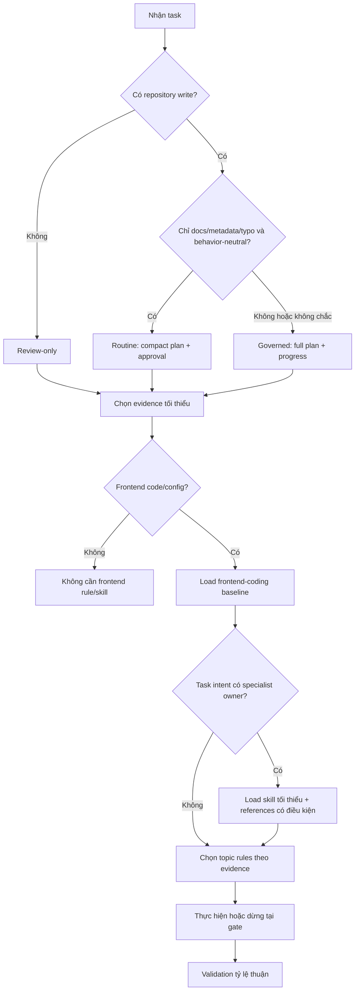

## 4. Luồng không dùng specialist skill

### Trường hợp

- Sửa mapper, DTO, module component hoặc route đã rõ ownership.
- Implement approved UI chỉ bằng component local đã có.
- Sửa styling, accessibility, asset hoặc React state không chạm workflow chuyên
  biệt.
- Review frontend code nhưng không phải security/dependency/test review.

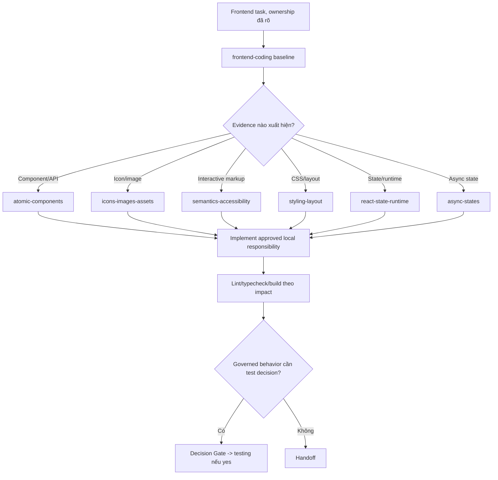

## 5. Skill flow theo từng task intent

## 5.1 `design-frontend-module-boundary`

### Các case được bao phủ

| Case                                    | Kết quả                                  |
| --------------------------------------- | ---------------------------------------- |
| Capability thuộc context đã có          | Đề xuất extension và placement           |
| Capability có business vocabulary riêng | Đề xuất bounded context mới              |
| Vendor/browser capability               | Integration adapter trong owning context |
| Presentation-neutral reusable UI        | Shared Atomic layer                      |
| Next.js routing/delivery                | `src/app` hoặc delivery boundary         |
| Source không phù hợp                    | Reject hoặc isolate                      |
| Evidence chưa đủ                        | `more-evidence-required`                 |
| Boundary cần thay đổi                   | `architecture-approval-required`         |

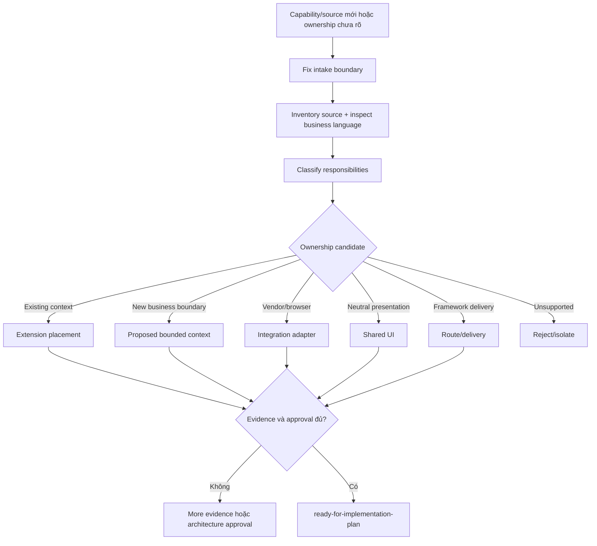

Đánh giá: workflow rõ và helper read-only đúng vai trò. Điểm có thể tối ưu là cho
migration/integration chấp nhận một boundary record còn hiệu lực trong analysis,
không bắt buộc chạy lại skill chỉ để xác nhận cùng một quyết định.

## 5.2 `migrate-legacy-frontend-module`

### Các case được bao phủ

- Legacy/demo thuộc project, target đã duyệt.
- Ownership chưa duyệt hoặc evidence làm đổi owner.
- Characterization trước migration.
- Strategy coexistence, strangler, slice hoặc big-bang cần so sánh.
- Temporary bridge, dual-run, cutover, rollback và removal.
- Source thật ra là external/vendor: chuyển sang supply-chain + integration.

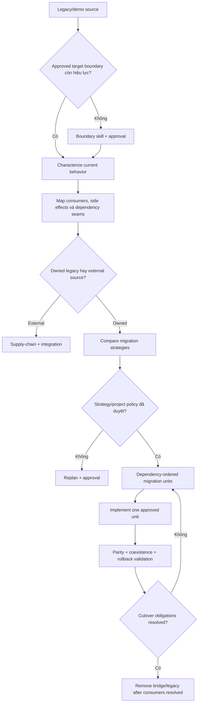

Đánh giá: guardrail mạnh, đúng cho migration rủi ro cao. Không nên dùng cho refactor
thông thường không có coexistence/cutover.

## 5.3 `audit-frontend-supply-chain`

### Các case được bao phủ

| Case                            | Nhánh                                         |
| ------------------------------- | --------------------------------------------- |
| Package mới                     | Adoption audit                                |
| Upgrade package                 | Upgrade/continued-use audit                   |
| Clone/vendor source             | Commit/artifact provenance audit              |
| Community shadcn item           | Nhận exact item từ shadcn inspect-only        |
| License/provenance only         | Offline evidence + conditional recommendation |
| Vulnerability/SBOM requested    | Scanner/SBOM reference, cần quyền phù hợp     |
| Browser threat                  | Handoff security                              |
| Thiếu identity/license/approval | `hold` hoặc `reject`                          |

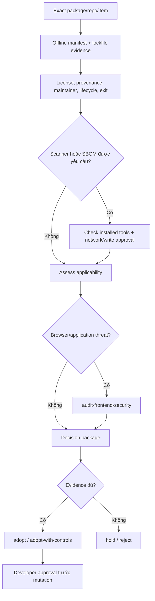

Đánh giá: phân biệt audit với mutation rất tốt. Helper chỉ hỗ trợ npm lockfile;
unsupported lockfile phải được báo, không được coi là sạch.

## 5.4 `integrate-third-party-frontend`

### Các mode được bao phủ

- Published package.
- Narrow wrapper.
- Vendored source/fork.
- iframe/embed.
- Separate deployment.
- Approved reimplementation.
- Worker, WASM/WebGL, global CSS, portal, CSP, asset, network và cleanup branches.

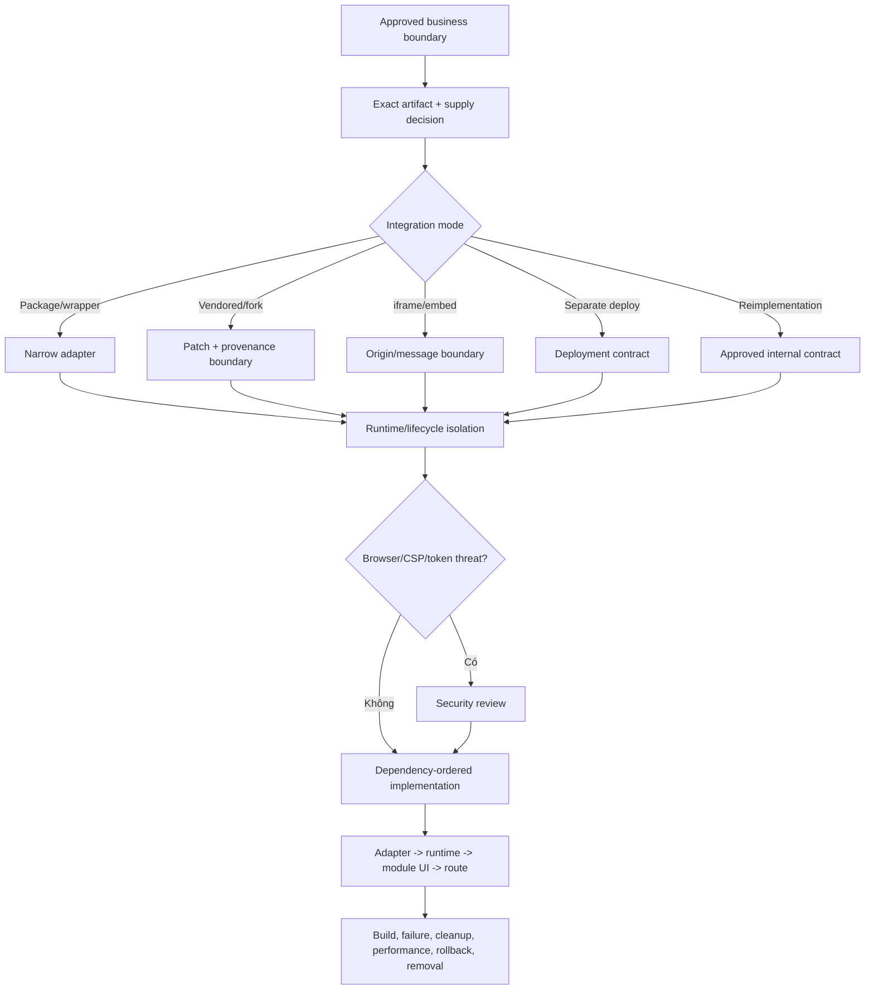

Đánh giá: đầy đủ và đúng boundary. Có thể bỏ lần chạy boundary mới nếu handoff
đã tồn tại và không bị evidence mới làm thay đổi.

## 5.5 `audit-frontend-security`

### Các mode được bao phủ

- Source/config review.
- Passive runtime inspection.
- Active authorized testing.
- Remediation.
- Retest.
- XSS, CSRF, CSP, URL/input, token/cookie/session, storage, message, realtime,
  upload, worker và vendor runtime.

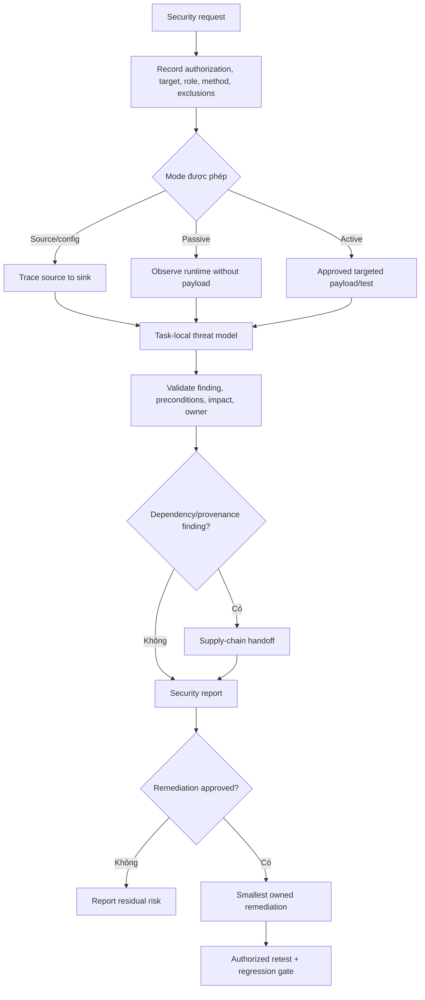

Đánh giá: authorization boundary tốt. Security source review vẫn được xếp governed,
hợp lý vì evidence có thể nhạy cảm và kết luận có risk cao.

## 5.6 `testing`

### Các case được skill mô tả

| Case                         | Reference/nhánh              | Thực thi hiện tại                       |
| ---------------------------- | ---------------------------- | --------------------------------------- |
| Unit domain/application/util | `unit-testing.md`            | Có Vitest                               |
| Component behavior           | `integration-testing.md`     | Có RTL/Vitest                           |
| Module integration/contract  | `integration-testing.md`     | Có nền tảng, cần inspect setup          |
| API/contract                 | `api-testing.md`             | Reference có, phải xác nhận runner/seam |
| Next.js E2E                  | `nextjs.md`                  | Chưa có Playwright                      |
| React browser/component E2E  | `react.md`                   | Chưa có Playwright                      |
| Locator/assertion/waiting    | locator/assertion refs       | Chỉ dùng sau Playwright adoption        |
| Auth/network E2E             | auth/network refs            | Chưa có Playwright, cần security scope  |
| Test configuration           | `configuration.md`           | Governed config task                    |
| Debug failed/flaky E2E       | `debugging.md`               | Chỉ khi runner/test tồn tại             |
| Run/review existing tests    | Skill description có trigger | AGENTS routing chưa ghi đủ              |
| Visual testing               | Testing rule nhắc tới        | Skill không có layer/reference rõ       |

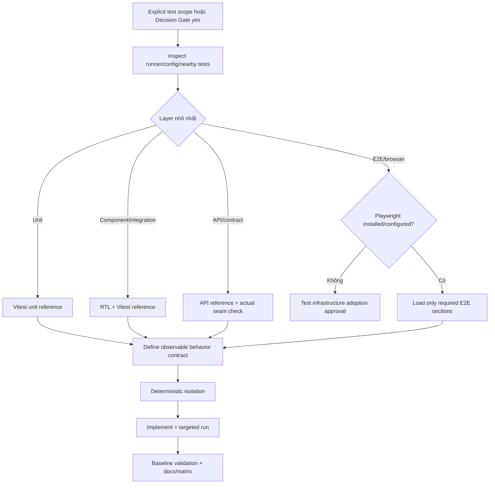

Đánh giá: entry skill tốt nhưng reference layer là rủi ro context lớn nhất. Một
authenticated Next.js E2E có thể kéo `nextjs + locators + assertions + auth +
network` lên hơn 21.000 từ trước source. Các reference phải route theo section và
không được đọc khi Playwright chưa được adopt.

## 5.7 `nextjs-tanstack-query`

### Các production case hiện có

| Nhóm                   | Cases                                                     |
| ---------------------- | --------------------------------------------------------- |
| Client reads           | list, detail, infinite list, debounced search             |
| Server hydration       | single, parallel, dynamic searchParams, auth bootstrap    |
| Create                 | invalidate list, direct cache insert                      |
| Update                 | dual invalidation, optimistic rollback                    |
| Delete                 | invalidate list, remove detail + navigate back            |
| Other cache operations | context-wide invalidation, route prefetch, manual refresh |
| Error handling         | error boundary with `throwOnError`                        |

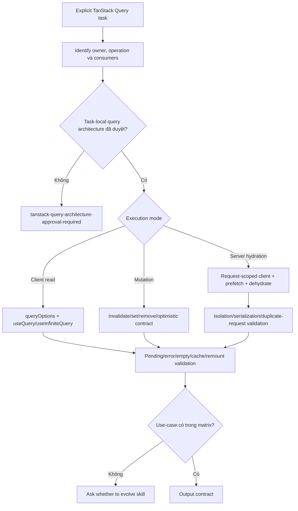

Đánh giá: boundary và architecture gate mạnh. Matrix 17 case nên chuyển ra một
reference index; entry skill chỉ cần selector. `Proactive Skill Evolution
Protocol` nên tạo recommendation trong handoff thay vì bắt buộc thêm một câu hỏi
ở cuối mọi use-case mới.

## 5.8 `orchestrate-frontend-design`

### Các case được bao phủ

- Screen/page/component appearance mới chưa có design.
- Chỉnh visual direction, layout, design system, prototype hoặc variant.
- Một provider rõ ràng hoặc cần chọn provider từ live capability.
- Single prompt hoặc staged prompt chain.
- Provider auth unavailable, capability unavailable, output incomplete.
- Existing developer-approved design: không trigger skill.

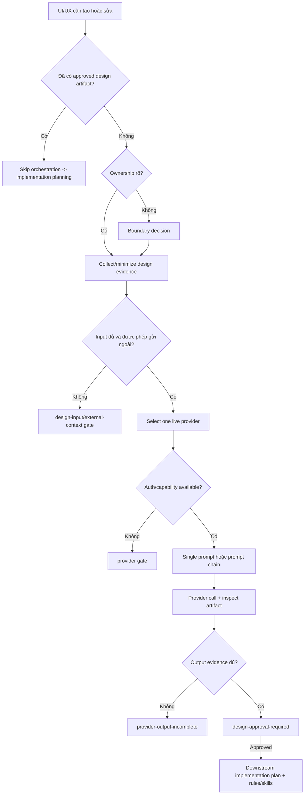

Đánh giá: responsibility boundary rất rõ. Không được coi provider HTML/code là
production source. Skill phụ thuộc live MCP/plugin; draft prompt không phải kết
quả thiết kế hoàn tất.

## 5.9 `shadcn`

### Các case được bao phủ

| Case                                  | Route                                                           |
| ------------------------------------- | --------------------------------------------------------------- |
| Tra docs/info                         | Inspect-only                                                    |
| Primitive đã cài                      | Local source + direct consumers                                 |
| Official primitive chưa cài           | Docs + dry-run/diff -> approval -> apply                        |
| Official preview thêm package/runtime | Supply/integration/security gate                                |
| Update primitive có local change      | Dry-run + per-file diff + manual merge                          |
| Preset                                | Inspect current/incoming -> overwrite/partial/merge/skip choice |
| Community/GitHub item                 | Inspect -> supply audit -> approval -> apply                    |
| Registry authoring                    | Routed sections trong `registry.md`                             |
| MCP                                   | Chỉ khi available/configured và explicit scope                  |
| Forms/composition/icons/styling/base  | Load đúng reference branch                                      |
| Chat registry                         | External gate trước `chat.md`                                   |
| Theme/customization                   | Approved design/token scope trước customization                 |

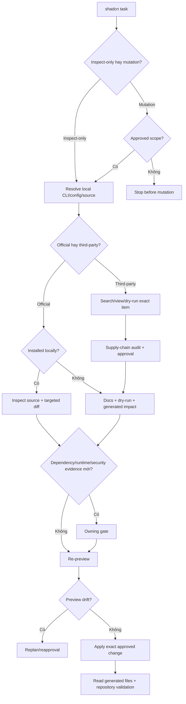

Đánh giá: sau tối ưu, đây là skill có mode và mutation boundary rõ nhất. 9 eval
fixture bao phủ forms/dialog/cards/chat, inspect-only, pre-plan dry-run,
dependency gate và routine path.

## 6. Rule flow theo evidence

### 6.1 Router

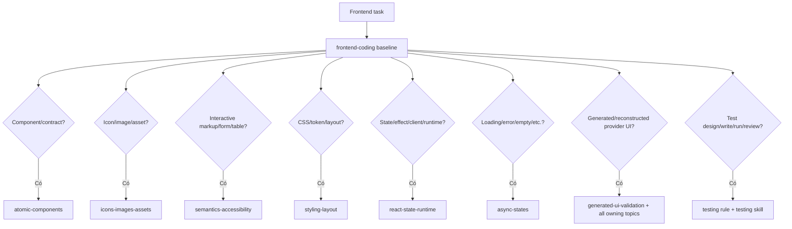

### 6.2 Case matrix

| Rule                 | Positive cases                                                                           | Gate/unresolved outcome                                     |
| -------------------- | ---------------------------------------------------------------------------------------- | ----------------------------------------------------------- |
| Atomic               | atom, molecule, organism, template, module UI, props, slots, callbacks, controlled state | Custom atom/render prop/new dual mode cần approval          |
| Assets               | Lucide, specialized symbol, custom SVG, Next Image, alt/dimensions                       | Missing icon/SVG/source giữ local unresolved                |
| Semantics            | button/link, landmark, heading, forms, ARIA, keyboard/focus, table                       | Custom complex widget/keyboard/focus cần separate approval  |
| Styling              | variant, token, Tailwind, provider CSS, desktop layout, z-index                          | Token/global CSS/mobile/inline-style exception cần approval |
| Runtime              | Server/Client, state owner, effect, hook/context/store, dynamic import                   | Hook/provider/store/dynamic boundary cần approval           |
| Async                | loading, pending, error, empty, no-result, no-selection, not-found, permission, config   | Visual pattern/copy/action chưa duyệt giữ unresolved        |
| Generated validation | Final cross-topic verification                                                           | Không cấp policy mới, chỉ index evidence                    |
| Testing rule         | Applicability, file placement, fixtures/mocks, Decision Gate                             | Explicit scope/yes gate trước tạo test                      |

### 6.3 Generic rule decision flow

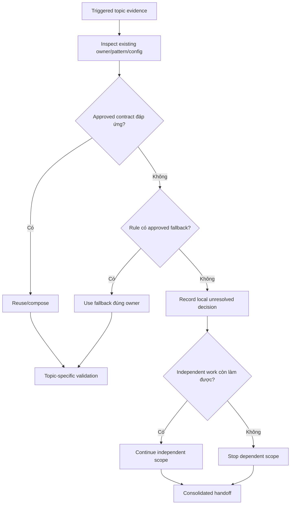

## 7. Composed task flows thường gặp

## 7.1 UI mới, ownership chưa rõ, chưa có design

```mermaid
flowchart LR
    A["Requirement"] --> B["Boundary skill"]
    B --> C["Architecture approval"]
    C --> D["Design orchestration"]
    D --> E["External provider artifact"]
    E --> F["Design approval"]
    F --> G["Frontend baseline + topic rules"]
    G --> H["shadcn nếu thiếu primitive"]
    H --> I["Implementation + validation"]
    I --> J["Testing Decision Gate"]
```

## 7.2 Implement từ approved Figma/image/provider artifact

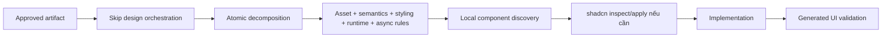

## 7.3 Legacy module migration

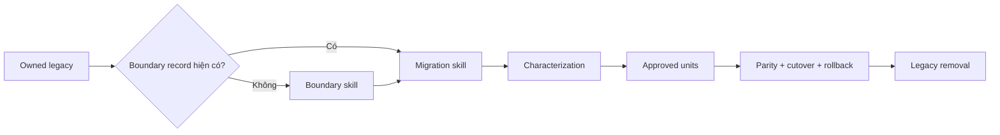

## 7.4 External package/repository/runtime

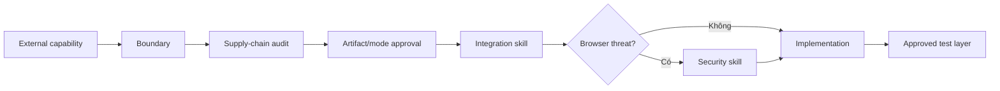

## 7.5 Community shadcn block

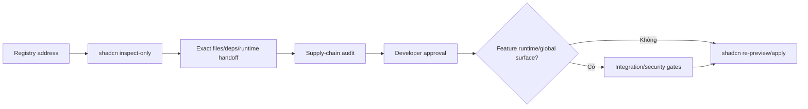

## 7.6 Official shadcn primitive có dependency mới

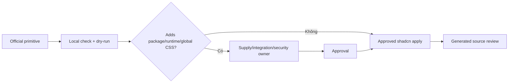

## 7.7 TanStack Query feature

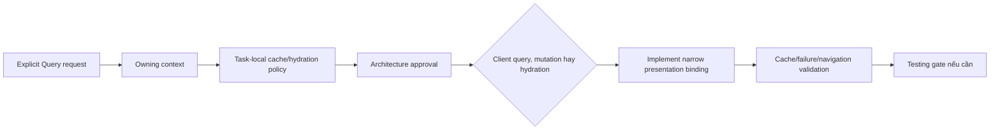

## 7.8 Security finding dẫn tới dependency review

```mermaid
flowchart LR
    A["Security review"] --> B["Confirmed/likely finding"]
    B --> C{"Root cause thuộc app hay package?"}
    C -->|"App/browser use"| D["Security remediation"]
    C -->|"Package/provenance"| E["Supply-chain audit"]
    E --> F["Upgrade/replace/hold decision"]
    D --> G["Authorized retest"]
    F --> G
```

## 7.9 Test-only request

```mermaid
flowchart LR
    A["Developer explicitly requests tests"] --> B["Gate already yes for named scope"]
    B --> C["Testing skill"]
    C --> D{"Runner exists?"}
    D -->|"Có"| E["Select layer + implement + run"]
    D -->|"Không"| F["Config/dependency adoption plan"]
    E --> G["Docs/behavior matrix"]
```

## 7.10 Documentation, governance hoặc report

```mermaid
flowchart LR
    A["Docs/report task"] --> B{"Repository write?"}
    B -->|"Không"| C["Review-only, no plan/progress"]
    B -->|"Có, behavior-neutral"| D["Routine compact plan"]
    B -->|"Có, đổi governance"| E["Governed change"]
    C --> F["Read relevant authority only"]
    D --> F
    E --> F
    F --> G["Format/link/diff validation"]
```

## 8. Findings theo mức ưu tiên

Không có P0.

### P1 - Testing reference quá lớn và chưa khớp installed capability

- Evidence: 11 reference, 38.851 từ; nhiều Playwright 1.59/1.60 API.
- Project evidence: không có `@playwright/test`, Playwright config hoặc E2E test.
- Failure mode: agent đọc setup/generic pattern quá sớm, quên project chưa adopt
  runner, hoặc nạp hơn 20.000 từ cho một authenticated E2E.
- Giải pháp: thêm capability gate ở đầu testing skill; khi Playwright chưa có,
  dừng trước E2E reference. Route tới section cụ thể thay vì đọc toàn file. Tách
  reference adoption/setup khỏi execution patterns.

### P1 - Testing routing không phủ hết trigger của skill

- `AGENTS.md` route hiện nhấn mạnh viết test.
- Skill description còn bao gồm design, run, debug, review, API và E2E.
- Testing rule còn nhắc visual testing nhưng skill không có visual layer/reference.
- Giải pháp: đồng bộ route thành `design/write/run/debug/review test or test
configuration`; quyết định rõ visual testing thuộc E2E artifact, screenshot
  comparison hay chưa được hỗ trợ.

### P1 - `generated-ui-validation` có trigger không thống nhất

- Router: UI generated hoặc substantially reconstructed từ provider artifact.
- File body: mọi UI được tạo hoặc materially changed.
- Failure mode: agent có thể load checklist 1.560 từ cho mọi UI change.
- Giải pháp: chọn một trigger canonical. Khuyến nghị giữ trigger hẹp của router;
  ordinary UI dùng topic validation riêng.

### P2 - Boundary skill có thể bị chạy lặp

- Migration và integration đều yêu cầu boundary result.
- AGENTS routes cũng đặt boundary trước hai skill.
- Khi analysis đã có exact owner/placement và evidence không thay đổi, chạy lại
  toàn workflow là context/approval duplication.
- Giải pháp: chấp nhận `approved boundary record` từ analysis/plan; chỉ gọi skill
  khi ownership absent, stale hoặc evidence mới làm thay đổi boundary.

### P2 - TanStack Query entry point quá nhiều chi tiết

- 1.319 từ và 20 direct links; matrix 17 case luôn được load.
- Giải pháp: giữ selector ngắn trong SKILL, chuyển matrix sang
  `references/decision-matrix.md`, đọc đúng recipe section.
- Proactive evolution nên là recommendation có evidence, không phải prompt bắt
  buộc ở cuối mọi case mới.

### P2 - Blanket approval cho mọi custom hook

- `react-state-runtime.md` yêu cầu explicit approval cho mọi project-authored
  custom hook.
- Đây là control hợp lý cho shared/stateful/effectful hook nhưng nặng với local
  behavior-neutral extraction.
- Giải pháp: chia local private hook không đổi ownership/behavior và public/shared
  hook. Chỉ nhánh thứ hai hoặc hook có side effect/runtime mới cần gate riêng.

### P2 - Test documentation rule có thể quá rộng

- Rule yêu cầu `.docs/<feature>.md` và behavior matrix sau execute hoặc skip test.
- Với test-only bugfix, utility unit test hoặc config debug, điều này có thể tạo
  feature doc không có owner tự nhiên.
- Giải pháp: update existing feature docs/matrix khi behavior contract thuộc một
  feature; test infrastructure/tooling ghi vào owning testing docs thay vì tạo
  feature doc giả.

### P3 - Icon matching dùng ngưỡng 80% khó tái lập

- Rule đã nói đây không phải numeric similarity, nhưng con số vẫn tạo cảm giác
  precision giả.
- Giải pháp: dùng semantic checklist pass/fail; chỉ giữ tỷ lệ như heuristic dành
  cho human review nếu team thực sự cần.

### P3 - Eval coverage tập trung ở shadcn

- Chỉ shadcn có 9 fixture.
- Các handoff rủi ro cao như boundary -> migration, external -> supply ->
  integration, testing without Playwright và provider unavailable chưa có eval.
- Giải pháp: thêm ít fixture dựa trên decision boundary, không snapshot prose.

## 9. Phần nên giữ nguyên

- Minimum skill selection và cấm scan catalog trong ordinary task.
- Rule/skill separation.
- Read-only helper không tự đưa ra architecture/security conclusion.
- Supply-chain audit không cấp mutation authority.
- Security authorization trước active test.
- Design provider output chỉ là design evidence.
- shadcn inspect-only/apply split, dry-run drift check và no implicit overwrite.
- TanStack Query không trở thành project-wide convention từ một feature.
- DDD dependency direction và Atomic/DDD ownership là hai quyết định khác nhau.
- Missing design/token/icon/async state chỉ block dependent scope.
- Testing chọn layer thấp nhất chứng minh behavior và phải chạy test đã tạo.

## 10. Backlog tối ưu đề xuất

### Đợt 1 - Safe routing/documentation

1. Đồng bộ testing route với toàn bộ description trigger.
2. Chốt trigger hẹp cho `generated-ui-validation.md`.
3. Thêm explicit `Playwright unavailable` gate dựa trên package/config evidence.
4. Thêm section-level lookup table cho testing references.
5. Làm rõ explicit user test request tương đương Decision Gate `yes` cho exact
   scope, không hỏi lại cùng quyết định.

### Đợt 2 - Context reduction

1. Tách TanStack Query matrix khỏi SKILL.
2. Chia testing reference lớn theo capability/section hoặc tạo index nhỏ.
3. Không load frontend baseline/topic rules cho pure domain unit test nếu không có
   production frontend evidence tương ứng.
4. Giữ `generated-ui-validation` như index ngắn, bỏ checklist lặp nguyên policy.

### Đợt 3 - Governance refinement

1. Cho migration/integration nhận approved boundary record còn hiệu lực.
2. Phân tầng approval cho custom hook.
3. Scope lại test documentation rule theo behavior owner.
4. Quyết định visual testing là supported, deferred hay thuộc E2E artifact.
5. Thêm eval cho boundary, supply/integration, testing capability và design
   provider gates.

## 11. Thuật toán routing tối thiểu đề xuất

```text
1. Classify task tier.
2. Nếu không phải frontend code/config/test: không load frontend system.
3. Load frontend-coding cho frontend work.
4. Chọn tối đa skill cần thiết từ task intent, không từ file tồn tại.
5. Chọn topic rules độc lập từ concrete evidence.
6. Nếu ownership chưa rõ: boundary trước dependent workflow.
7. Nếu chưa có approved visual artifact: external design orchestration.
8. Nếu source external: exact identity -> supply audit -> approval.
9. Nếu runtime/vendor surface: integration; nếu browser threat: security.
10. Nếu shadcn: inspect-only trước gate, mutation sau approved drift check.
11. Nếu Query: task-local architecture approval trước implementation.
12. Nếu tests: explicit scope/gate -> installed runner check -> lowest layer.
13. Validation theo changed surface; không load test skill cho lint/typecheck.
```

## 12. Coverage và giới hạn của báo cáo

Đã kiểm tra:

- toàn bộ 9 `SKILL.md`;
- toàn bộ 9 rule runtime;
- frontmatter trigger và AGENTS routing;
- 39 resource path và direct linkage;
- heading/size của toàn bộ reference;
- helper script boundary và supply-chain;
- package/test/query/shadcn capability hiện tại;
- task tier, mutation gate, handoff và composed routes;
- 9 shadcn eval fixture hiện có.

Giả lập trong báo cáo là static decision-path simulation dựa trên source hiện
tại. Không chạy isolated agent/subagent evaluator, không active security test,
không gọi external design provider, không cài Playwright và không chạy shadcn
mutation. Vì vậy báo cáo đánh giá tính đầy đủ và nhất quán của workflow, không
chứng minh mọi agent host sẽ tuân thủ routing trong runtime thực tế.

## 13. Kết luận cuối

Catalog không có quá nhiều skill. Số lượng 9 là hợp lý vì mỗi skill có ownership
khác nhau. Rủi ro context hiện tập trung ở **testing references**, TanStack Query
matrix và checklist generated UI, không còn tập trung ở shadcn.

Ưu tiên tiếp theo nên là tối ưu testing flow trước, sau đó làm rõ boundary reuse
và generated validation trigger. Không nên thêm skill mới hoặc gộp skill hiện có
trước khi ba điểm này được xử lý.
