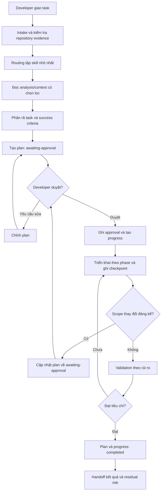

# Tiến trình làm việc của agent

## Mục đích

Tài liệu này mô tả ba task tier và vòng đời đầy đủ của governed change: từ lúc developer gửi yêu cầu,
agent thu thập context, lập plan, chờ phê duyệt, triển khai, kiểm chứng cho đến khi handoff kết quả.

Mục tiêu thứ hai là cung cấp một blueprint đủ cụ thể để thành viên có thể thử xây agent process tương
tự cho repository cá nhân mà không phải tự phát hiện lại toàn bộ approval gate, artifact và trạng
thái cần có.

Nguồn vận hành chính là [`AGENTS.md`](../../AGENTS.md). Tài liệu về cách chọn và phối hợp skill nằm ở
[`skill.md`](skill.md). Tài liệu này giải thích hai nguồn đó; nó không thay thế chúng.

## Task tier

| Tier              | Phạm vi                                                                            | Artifact bắt buộc                                                      |
| ----------------- | ---------------------------------------------------------------------------------- | ---------------------------------------------------------------------- |
| `review-only`     | Chỉ inspect/giải thích, không ghi repository                                       | Không plan/progress/Testing Gate                                       |
| `routine change`  | Docs/metadata/typo/maintenance cục bộ không đổi behavior                           | Compact plan + approval; progress chỉ khi dài hoặc có nhiều checkpoint |
| `governed change` | Architecture, behavior, contract, dependency/source, migration, security hoặc test | Full plan + approval + progress + testing workflow khi in-scope        |

Khi không chắc phải nâng tier. Tier thấp không được bỏ qua specialized gate. `AGENTS.md` là nguồn
canonical cho tiêu chí chi tiết.

## Mô hình governed change

Một task không đi thẳng từ prompt tới code. Nó đi qua ba lớp kiểm soát:

1. **Context control:** chỉ đọc đúng architecture, skill và source liên quan.
2. **Change control:** mô hình hóa tác động và nhận developer approval trước khi sửa implementation.
3. **Evidence control:** ghi tiến trình, kiểm chứng theo rủi ro và báo đúng giới hạn trước khi tuyên
   bố hoàn tất.



Điểm quan trọng nhất là hai vòng lặp:

- **Review loop:** plan có thể được sửa nhiều lần trước approval.
- **Replanning loop:** implementation phải quay lại approval nếu evidence làm thay đổi scope đáng kể.

## Các artifact tham gia

| Artifact                                     | Vai trò                                                                     | Có được commit?                        |
| -------------------------------------------- | --------------------------------------------------------------------------- | -------------------------------------- |
| Yêu cầu của developer                        | Xác định mục tiêu, phạm vi và authority ban đầu.                            | Không phải file bắt buộc.              |
| `AGENTS.md`                                  | Entry point, thứ tự đọc, routing, approval workflow và convention bắt buộc. | Có.                                    |
| `.analysis/README.md`                        | Quyết định kiến trúc cấp dự án và index bounded context.                    | Có.                                    |
| `.analysis/<context>.md`                     | Quyết định đã duyệt của context bị ảnh hưởng.                               | Có.                                    |
| `.agents/rules/*`                            | Quy tắc thực thi dùng chung theo loại code/config.                          | Có.                                    |
| `.agents/skills/<name>`                      | Workflow chuyên biệt được chọn theo task intent.                            | Có.                                    |
| `.plans/<timestamp>-<task>-plan.md`          | Compact/full impact model khi task tier yêu cầu.                            | Có.                                    |
| `.progresses/<timestamp>-<task>-progress.md` | Runtime checkpoint cho governed hoặc routine dài.                           | Không; bị ignore.                      |
| Implementation files                         | Source, config, test hoặc docs tạo ra kết quả của task.                     | Tùy loại file, thường có.              |
| Validation evidence                          | Command/result, artifact hoặc kiểm tra chứng minh success criteria.         | Chỉ commit artifact khi plan cho phép. |

Khi progress được tạo, plan và progress có cùng timestamp/task name để truy vết một-một. Ví dụ:

```text
.plans/20260717-0945-document-agent-system-plan.md
.progresses/20260717-0945-document-agent-system-progress.md
```

Progress là runtime-only. Developer có thể xóa progress đã hoàn tất theo chính sách repository; agent
không tự xóa nó ở cuối task.

## Trạng thái chuẩn

### Plan

```text
awaiting-approval -> in-progress -> completed
         ▲                │
         └── material scope change
```

- `awaiting-approval`: plan sẵn sàng để developer review; implementation chưa được phép bắt đầu.
- `in-progress`: approval đã được ghi và implementation đang diễn ra.
- `completed`: kết quả và validation đã hoàn tất, không còn việc bắt buộc trong scope.

Phần `Approval` trong plan nên có trạng thái riêng (`pending` hoặc `approved`), người duyệt, thời điểm
và phạm vi được duyệt. Điều này tránh hiểu nhầm rằng việc developer đồng ý với ý tưởng ban đầu đã là
approval cho một impact model chưa tồn tại.

### Progress

Progress tổng thể dùng `in-progress` và `completed`. Mỗi phase/checkpoint có thể dùng:

- `pending`;
- `in-progress`; hoặc
- `completed`.

Nếu bị chặn, ghi rõ trong `Blockers`, current phase và evidence đã thử. Không đánh dấu `completed` chỉ
vì agent dừng làm việc hoặc hết thời gian.

## Quy trình chi tiết từ đầu đến cuối

### Bước 1 - Tiếp nhận task

Agent xác định:

- kết quả developer thật sự muốn;
- task là giải thích, review, diagnose, change/build hay monitor;
- repository/source/environment nào nằm trong scope;
- hành động nào chỉ đọc và hành động nào tạo side effect;
- quyền nào đã được cấp rõ ràng; và
- ambiguity nào có thể làm thay đổi ownership, architecture hoặc external state.

Agent được phép dùng giả định nhỏ để tiếp tục điều tra read-only. Nếu một lựa chọn sẽ làm kết quả rẽ
sang hướng materially khác, agent phải nêu ambiguity và xin direction thay vì tự cấp quyền.

### Bước 2 - Đọc entry point

Agent đọc `AGENTS.md` trước khi đề xuất architecture hoặc tạo/move/change file. Entry point cho biết:

- nguồn nào phải đọc;
- skill routing;
- plan/progress workflow;
- convention không được vi phạm; và
- cách xử lý xung đột.

Đây là nơi nên chứa rule ngắn, luôn cần ở mọi task. Kiến thức dài hoặc theo domain không nên chép hết
vào entry point vì sẽ làm mọi lần chạy tốn context.

### Bước 3 - Chọn tập skill nhỏ nhất

Agent đối chiếu task intent với bảng routing trước khi mở bất kỳ skill body nào. Sau đó:

1. Chọn không có, một hoặc nhiều skill có thứ tự.
2. Đọc đúng `SKILL.md` đã chọn.
3. Chỉ đọc reference được workflow yêu cầu cho nhánh hiện tại.
4. Ghi skill đã dùng vào plan khi task tier yêu cầu plan.

Không có skill phù hợp không phải lỗi. Agent tiếp tục bằng rule chung của repository và không quét mọi
skill để tìm một match yếu.

### Bước 4 - Nạp architecture có chọn lọc

Agent đọc `.analysis/README.md`, sau đó xác định bounded context từ task và repository evidence.

- Chỉ đọc `.analysis/<context>.md` của context bị ảnh hưởng.
- Chỉ đọc thêm context khác khi có dependency hoặc boundary crossing có evidence.
- Đọc `src/modules/README.md` khi task chạm module/DDD.
- Đọc rule frontend khi tạo, sửa, move, delete hoặc review frontend code/config.
- Đọc local Next.js documentation khi dùng framework API/version behavior.

Mọi analysis đã dùng phải được ghi vào plan khi plan tồn tại. Cách đọc chọn lọc giúp giảm token và tránh để quyết định
của module không liên quan làm lệch task.

### Bước 5 - Kiểm tra repository evidence

Trước khi đề xuất file, agent kiểm tra source hiện có:

- đường dẫn, naming và ownership;
- import/consumer trực tiếp;
- config, package, lockfile và toolchain liên quan;
- test và CI hiện có;
- dirty worktree và thay đổi thuộc developer;
- contract/deferred decision trong analysis; và
- tài liệu framework hoặc external source nếu task cần.

Giai đoạn này mặc định read-only. Agent phải bảo toàn thay đổi chưa commit không thuộc task và không
được dùng lệnh destructive để “làm sạch” worktree.

### Bước 6 - Phân rã task và định nghĩa success criteria

Agent chuyển yêu cầu thành:

- objective có thể quan sát;
- phần trong và ngoài scope;
- dependency giữa các phase;
- file dự kiến thay đổi;
- validation cho từng bề mặt rủi ro; và
- replanning gate.

Success criteria phải mô tả trạng thái cuối có thể kiểm chứng, không chỉ là “đã viết code” hoặc “build
thành công”.

### Bước 7 - Tạo plan khi tier yêu cầu

Plan được đặt tại:

```text
.plans/<yyyyMMdd-HHmm>-<lowercase-hyphen-task-name>-plan.md
```

Đây là **repository write duy nhất được phép trước approval**. Plan phải ở trạng thái
`awaiting-approval`, sau đó agent dừng implementation và gửi developer review.

Routine plan dùng compact impact theo `AGENTS.md`. Governed plan không chỉ là checklist; nó là impact
model gồm:

1. context/evidence/skill đã dùng;
2. objective và scope;
3. phân tích từng file;
4. phase theo thứ tự dependency;
5. validation matrix;
6. success criteria;
7. replanning gate; và
8. approval record.

### Bước 8 - Developer review và approval

Developer có thể:

- duyệt nguyên plan;
- yêu cầu sửa phạm vi, thứ tự, file, risk/control hoặc validation; hoặc
- từ chối/hoãn task.

Nếu có yêu cầu sửa, agent chỉ cập nhật plan, giữ trạng thái `awaiting-approval` và gửi review lại.
Không có giới hạn số vòng review.

Approval hợp lệ phải đến sau khi plan reviewable đã tồn tại. Agent ghi:

- `Approved by`;
- `Approved at`;
- exact scope được duyệt; và
- các quyền đặc biệt như network, install, external write hoặc active testing nếu có.

### Bước 9 - Khởi tạo progress khi tier yêu cầu

Với governed change, hoặc routine plan xác định cần checkpoint, ngay sau approval và trước implementation:

1. Đổi plan sang `in-progress` và ghi approval.
2. Tạo progress cùng timestamp/task name.
3. Ghi context, current phase và approved scope.
4. Xác nhận progress bị `.gitignore` bỏ qua.

Progress không phải bản sao đầy đủ của plan. Plan nói **sẽ làm gì và vì sao**; progress nói **đã xảy ra
gì, kết quả ra sao và khác plan ở đâu**.

### Bước 10 - Triển khai theo dependency

Agent thực hiện phase theo thứ tự đã duyệt. Một phase chỉ bắt đầu khi prerequisite của nó đã tồn tại
hoặc được xác nhận.

Khi progress tồn tại, tại checkpoint có ý nghĩa phải ghi:

- phase/status;
- file đã thay đổi;
- output đã tạo;
- validation đã chạy và kết quả;
- blocker/unknown;
- deviation so với plan; và
- next phase.

Checkpoint nên gắn với output hoặc gate, không ghi log cho từng command nhỏ đến mức làm mất tín hiệu.
Trong lúc chạy lâu, agent gửi commentary ngắn để developer biết trạng thái.

### Bước 11 - Xử lý thay đổi scope

Khi evidence mới làm scope thay đổi đáng kể, agent phải dừng implementation:

1. Ghi tình trạng vào progress.
2. Cập nhật impact model và phase trong plan.
3. Đưa plan về `awaiting-approval`.
4. Chờ developer duyệt lại.
5. Chỉ tiếp tục sau approval mới.

Ví dụ material scope change:

- thêm/xóa/move file ngoài danh sách hoặc khác ownership;
- tạo bounded context, shared convention hoặc public contract mới;
- thêm dependency, package manager, test framework hoặc CI job;
- đổi integration mode, deployment, CSP hoặc auth policy;
- cần network/external write/active test chưa được phép;
- xóa legacy sớm hơn cutover/removal gate; hoặc
- thay đổi success criteria làm sản phẩm hành xử khác yêu cầu ban đầu.

Sửa typo trong file đã duyệt, format do tool yêu cầu hoặc correction nhỏ để đạt validation thường
không phải material change nếu không thay đổi behavior, risk hoặc consumer surface. Progress vẫn phải
ghi correction đáng chú ý.

### Bước 11.1 - Testing Decision Gate Workflow

Đối với governed change làm thay đổi feature behavior, business/module logic hoặc critical contract,
agent bắt buộc thực thi Decision Gate sau khi hoàn tất triển khai logic ban đầu. Review-only và routine
exempt không tạo prompt giả tạo.

```text
Triển khai Feature / Component / Logic
        │
        ▼
Kiểm tra Baseline (npm run typecheck / npm run lint)
        │
        ▼
Hỏi Developer Decision Gate Prompt:
"🧪 DECISION GATE: Viết test [Lớp Test] cho [Feature/Component]? (yes / no)"
        │
   ┌────┴────────────────────────┐
   ▼                             ▼
[YES - Approved]          [NO - Skipped / Deferred]
   │                             │
Kích hoạt skill `testing`     Bỏ qua tạo test file,
Viết & chạy test runner       Cập nhật Behavior Matrix
(vitest / playwright)         trong .analysis/<context>.md
   │                             │
   └────────────┬────────────────┘
                ▼
Cập nhật Docs & Behavior Matrix sang Completed / Deferred
```

- **If YES**: Chuyển sang nạp skill `testing`, khởi tạo file test (Unit, Component, Integration, hoặc E2E) và thực thi test runner (`npx vitest run` / `npx playwright test`) để xác nhận pass 100%.
- **If NO**: Không tự ý tạo file test rác. Đánh dấu trạng thái test là `skipped/deferred` trong `.analysis/<context>.md`.

### Bước 12 - Validation theo rủi ro

Validation không phải một command cố định cho mọi task. Agent chọn kiểm tra tương xứng với bề mặt đã
thay đổi:

- Markdown/docs: format, link, content parity, spelling/encoding, diff scope.
- TypeScript/React: targeted test, lint, typecheck, build và consumer review theo rủi ro.
- Migration: baseline/parity, coexistence, cutover, rollback và legacy consumer.
- Third-party: provenance, build/runtime, asset/CSP, lifecycle, performance, update/removal.
- Security: evidence validation và authorized retest.
- Browser E2E: setup/environment, narrow journey, browser matrix và artifact review.

Agent chạy kiểm tra hẹp trước để có feedback nhanh, sau đó mở rộng theo impact. Kết quả phải ghi command,
exit/result và phần coverage chưa có. Một build hoặc một test pass không chứng minh toàn bộ behavior.

Nếu validation fail:

1. Chẩn đoán nguyên nhân bằng evidence.
2. Sửa trong approved scope khi correction không material.
3. Quay lại replanning nếu fix cần mở rộng scope hoặc đổi contract.
4. Chạy lại validation bị ảnh hưởng.
5. Không che failure bằng cách hạ assertion, tắt rule hoặc bỏ validation mà không báo.

### Bước 13 - Hoàn tất và handoff

Task chỉ hoàn tất khi:

- objective và success criteria đã đạt;
- không còn việc bắt buộc trong approved scope;
- validation cần thiết đã pass hoặc giới hạn được developer chấp nhận;
- changed-file list chính xác;
- blocker/deviation/residual risk được ghi; và
- plan/progress được đánh dấu `completed` khi các artifact đó được task tier yêu cầu.

Final handoff nên dẫn đầu bằng outcome, sau đó nêu:

- file quan trọng đã thay đổi;
- behavior/decision chính;
- validation đã chạy;
- limitation hoặc residual risk;
- việc tiếp theo chỉ khi thực sự cần developer thực hiện.

Final response phải tự đủ nghĩa; developer không nên phải mở lại commentary đã bị thu gọn để hiểu kết
quả.

## Phân tích tác động theo file trong plan

Mọi file được tạo, sửa, move hoặc delete cần một entry riêng với bốn trường.

### `Why`

Giải thích vì sao chính file này cần thay đổi để đạt outcome. Không dùng lý do chung như “phục vụ
feature” nếu không chỉ ra trách nhiệm cụ thể của file.

### `Affected`

Liệt kê consumer và downstream surface đã biết:

- import/caller;
- route/template/module;
- public contract/API;
- test/config/CI;
- generated artifact;
- documentation; hoặc
- không có runtime consumer nếu là tài liệu độc lập.

Nếu chưa biết consumer, ghi rõ uncertainty và inspection cần làm. Không được tuyên bố “không ảnh
hưởng” chỉ vì chưa kiểm tra.

### `Risk`

Mô tả regression, migration concern, residual uncertainty hoặc operational risk còn lại sau thay đổi.
Risk có thể là behavior, ownership, security, compatibility, data, performance, rollout hoặc
maintainability.

### `Control`

Nêu cách implementation hoặc validation giảm từng risk: adapter, type boundary, characterization,
feature gate, targeted test, browser evidence, rollback hoặc review.

Ví dụ rút gọn:

```markdown
### F01 - `src/modules/example/application/use-cases/load-example.ts`

- **Why:** Tách orchestration của use case khỏi route.
- **Affected:** Route `/example`, port dữ liệu và presentation hook đang gọi flow cũ.
- **Risk:** Hai flow cùng gửi request trong giai đoạn coexistence.
- **Control:** Một directional adapter, characterization test và cutover gate theo consumer map.
```

## Thiết kế phase theo dependency

Mỗi phase phải trả lời năm câu hỏi:

1. Output cụ thể là gì?
2. Phụ thuộc phase hoặc repository state nào trước đó?
3. Output này cho phép hoặc giới hạn phase sau ra sao?
4. File impact entry nào được thực hiện?
5. Điều kiện nào chứng minh phase hoàn tất?

Ví dụ:

```markdown
### Phase 2 - Tạo port và adapter

- **Output:** Contract nội bộ và adapter cho API cũ.
- **Depends on:** Ownership và source-to-target map đã được duyệt ở Phase 1.
- **Effect on later phases:** Presentation chỉ được migrate sau khi contract ổn định.
- **Files:** F03-F05.
- **Completion criteria:** Typecheck đạt, mapping cases được test, chưa chuyển route consumer.
```

Hai phase chỉ nên chạy song song khi:

- file và responsibility độc lập;
- prerequisite chung đã ổn định;
- integration point được nêu rõ; và
- có bước reconcile output.

Nếu không giải thích được bốn điểm đó, dùng thứ tự tuần tự.

## Cấu trúc tối thiểu của plan

```markdown
# <Task> Plan

## Metadata

- Task:
- Created:
- Status: awaiting-approval
- Progress file:

## Decision summary

## Planning context

### Analysis loaded

### Skills used

### Repository evidence inspected

## Objective

## File-level impact analysis

### F01 - `<path>`

- **Why:**
- **Affected:**
- **Risk:**
- **Control:**

## Dependency-ordered implementation sequence

### Phase 1 - <name>

- **Output:**
- **Depends on:**
- **Effect on later phases:**
- **Files:**
- **Completion criteria:**

## Validation matrix

## Success criteria

## Scope boundaries

## Replanning gate

## Approval

- Status: awaiting-approval
- Approved by: pending
- Approved at: pending
```

Đây là schema tối thiểu mang tính hướng dẫn. Repository cụ thể có thể thêm security authorization,
rollout, data migration hoặc artifact policy khi task cần.

Các plan lịch sử của repository nguồn không nằm trong base này. Khi áp dụng workflow, tạo plan mới
trong `.plans/` của chính repository đang được xử lý.

## Cấu trúc tối thiểu của progress

```markdown
# <Task> Progress

## Metadata

- Task:
- Plan:
- Started:
- Last updated:
- Status: in-progress
- Current phase:

## Approval

- Approved by:
- Approved at:
- Approved scope:

## Context used

## Checkpoints

### Phase 1 - <name>

- Status:
- Changed files:
- Validation:
- Next:

## Changed files

## Validation results

## Blockers

## Deviations
```

Progress nên ghi sự thật thực thi, bao gồm cả command fail, tool limitation và validation bị bỏ qua.
Không sửa lịch sử để làm task trông “sạch” hơn; thay vào đó ghi correction và kết quả cuối.

## Phân vai giữa developer và agent

| Developer                                                      | Agent                                             |
| -------------------------------------------------------------- | ------------------------------------------------- |
| Xác định outcome và business priority.                         | Làm rõ outcome bằng task evidence.                |
| Duyệt hoặc yêu cầu sửa plan.                                   | Tạo impact model reviewable trước implementation. |
| Quyết định architecture/deferred policy khi cần.               | Không tự chốt vấn đề đang deferred.               |
| Cấp authority cho install/network/external action/active test. | Giữ hành động trong authority đã cấp.             |
| Chấp nhận risk, rollout hoặc limitation quan trọng.            | Báo evidence, unknown và residual risk minh bạch. |
| Review/commit/delete runtime progress theo quy trình team.     | Không stage/commit/delete nếu task không yêu cầu. |

Approval không chuyển toàn bộ trách nhiệm sang agent. Agent vẫn phải dừng khi scope mới vượt quá những
gì developer đã duyệt.

## Các nhánh đặc biệt

### Không có skill phù hợp

Dùng rule chung và workflow plan/progress. Không tạo skill mới hoặc quét mọi skill chỉ để gắn một tên
cho task.

### Không xác định được ownership

Thu thập evidence trước. Nếu vẫn có nhiều lựa chọn làm thay đổi bounded context, dừng ở boundary
decision hoặc hỏi developer; không chọn theo folder name/source cũ.

### Yêu cầu xung đột analysis

Nêu rõ conflict. Nếu developer xác nhận thay đổi quyết định cấp dự án, update `.analysis/README.md`;
nếu module-specific, update `.analysis/<context>.md`; nếu cả hai scope, update cả hai trong plan đã
duyệt.

### Thiếu tool hoặc dependency

Khám phá tool hiện có và ghi limitation. Không tự install chỉ vì công cụ tiện hơn. Nếu install cần
thiết, thêm package/config/lockfile/CI impact vào plan và xin approval.

### Worktree đã có thay đổi

Xác định file nào thuộc developer hoặc task khác. Bảo toàn chúng, tránh format toàn repo hoặc lệnh
destructive. Nếu task chạm cùng file và không thể tách an toàn, báo conflict để developer quyết định.

### Validation không thể chạy

Ghi nguyên nhân, phần đã kiểm tra, phần chưa được kiểm tra và residual risk. Tìm fallback an toàn trong
scope; nếu cần quyền hoặc tool mới, quay lại approval thay vì tuyên bố pass.

### Developer gửi yêu cầu mới khi agent đang chạy

Đánh giá yêu cầu mới thay thế hay bổ sung task hiện tại. Nếu thay thế, dừng công việc cũ và chuyển
focus; nếu bổ sung nhưng làm scope thay đổi đáng kể, cập nhật plan và xin duyệt lại.

## Blueprint cho repository cá nhân

### Cấu trúc khởi đầu đề xuất

```text
<repo>/
├── AGENTS.md
├── .analysis/
│   ├── README.md
│   └── <context>.md
├── .agents/
│   ├── rules/
│   └── skills/
├── .plans/
├── .progresses/
│   └── .gitkeep
├── .docs/                       # Tùy chọn: lớp giải thích cho con người
└── .gitignore
```

Không cần tạo toàn bộ ngay ngày đầu. Thành phần tối thiểu để thử nghiệm process là `AGENTS.md`,
`.plans`, `.progresses` và ignore policy. Thêm analysis/skill khi repository có architecture hoặc
workflow chuyên biệt cần quản lý.

### Bước 1 - Chọn nguồn sự thật

Quy định rõ file nào sở hữu:

- architecture;
- coding convention;
- task workflow;
- specialist workflow; và
- developer-facing explanation.

Không để cùng một rule được copy nguyên văn vào nhiều nơi mà không có thứ tự ưu tiên.

### Bước 2 - Viết entry point ngắn

`AGENTS.md` nên chứa:

1. thứ tự đọc;
2. routing ngắn;
3. approval gate;
4. plan/progress naming;
5. non-negotiable conventions; và
6. conflict handling.

Không chép toàn bộ framework/domain docs vào file luôn được nạp.

### Bước 3 - Thiết kế plan schema

Bắt đầu bằng `Why`, `Affected`, `Risk`, `Control`, phase dependency và success criteria. Chọn rõ task
nào dùng review-only, compact plan hay full governed plan; boundary phải viết rõ thay vì để agent tự
đoán.

### Bước 4 - Tách progress khỏi plan

- Plan là artifact review/commit.
- Progress là runtime log/ignore.
- Dùng cùng ID/timestamp để liên kết.
- Không để progress trở thành nguồn kiến trúc lâu dài.

Thêm rule Git tương đương:

```gitignore
.progresses/*
!.progresses/.gitkeep
```

Điều chỉnh syntax theo ignore policy hiện có; kiểm tra bằng `git check-ignore`.

### Bước 5 - Thêm routing trước khi catalog lớn

Mỗi route chỉ cần:

- task intent;
- skill chính;
- skill bổ sung có điều kiện; và
- thứ tự composition.

Mục tiêu là chọn skill mà không scan catalog. Khi catalog thay đổi, update routing và forward-test
bằng prompt tự nhiên không gọi tên skill.

### Bước 6 - Định nghĩa authority boundary

Tách các quyền:

- read source;
- write repository;
- install dependency;
- network access;
- external write/publish/message;
- active security testing; và
- destructive action.

Không dùng một approval chung chung để suy ra mọi quyền.

### Bước 7 - Định nghĩa completion

Một task được hoàn tất khi outcome, validation và artifact lifecycle đều đóng. Viết rõ:

- check bắt buộc theo loại thay đổi;
- cách ghi skipped check;
- khi nào phải replan;
- ai xóa progress;
- agent có được stage/commit/push không; và
- final handoff cần những gì.

### Bước 8 - Chạy pilot và cải tiến

Thử ít nhất các tình huống:

1. task nhỏ không cần specialist skill;
2. task có một skill;
3. task cần nhiều skill theo thứ tự;
4. task có dirty worktree;
5. developer yêu cầu sửa plan;
6. implementation phát hiện material scope change;
7. validation fail hoặc tool thiếu; và
8. task cần authority bên ngoài.

Quan sát agent có đọc thừa, viết trước approval, che unknown hoặc bỏ progress checkpoint hay không.
Sửa entry point/routing trước khi thêm nhiều skill mới.

## Ví dụ end-to-end: nhận một mapping project bên ngoài

### Intake

Developer yêu cầu clone một mapping/WebGL demo và tích hợp như capability mới. Agent chưa được phép
coi folder upstream là một bounded context.

### Routing

```text
design-frontend-module-boundary
    -> audit-frontend-supply-chain
    -> integrate-third-party-frontend
    -> test-frontend-with-playwright (chỉ khi browser verification nằm trong scope)
```

### Context và evidence

Agent đọc project overview, candidate context analysis, DDD rule, source manifest, license, exact
commit, worker/WASM/CSS/asset và consumer mong đợi.

### Plan

Plan mô hình hóa:

- analysis/context có thể phải đổi;
- package/lock hoặc vendored artifact;
- adapter contract;
- runtime asset/CSP/config;
- owning module presentation;
- route/template composition;
- test/artifact;
- update, rollback và removal.

Plan dừng ở `awaiting-approval`; source chưa được tích hợp.

### Approval và progress

Sau developer approval, agent ghi exact artifact/integration mode được duyệt, tạo progress và bắt đầu
phase provenance/build reproducibility trước adapter/runtime/module composition.

### Replanning

Nếu phát hiện upstream cần postinstall có network hoặc CSP origin mới chưa nằm trong plan, agent dừng,
cập nhật risk/config impact và xin duyệt lại.

### Validation và completion

Agent kiểm tra build/type, worker/WASM/assets, lifecycle cleanup, failure path, browser journey,
performance boundary, rollback và update/removal owner. Chỉ sau đó plan/progress mới được đánh dấu
`completed`.

## Anti-pattern cần tránh

- Bắt đầu sửa source rồi mới viết plan khi task tier yêu cầu plan.
- Xem “developer đồng ý ý tưởng” là approval cho file impact chưa được review.
- Dùng plan như checklist phẳng không có consumer/risk/dependency.
- Tạo progress trước approval hoặc commit progress runtime vào repository.
- Không cập nhật progress vì “mọi thứ đang đúng plan”.
- Tiếp tục làm khi scope đã thay đổi và xin approval ở cuối.
- Đánh dấu completed khi chỉ mới code xong nhưng chưa validation.
- Chạy mọi validation của repo cho mọi thay đổi nhỏ mà không cân nhắc rủi ro.
- Ngược lại, chỉ chạy compile và gọi đó là behavior/security/migration proof.
- Xóa hoặc overwrite dirty worktree của developer.
- Tự cài tool, truy cập mạng hoặc tạo external side effect vì tool đang khả dụng.
- Giấu command fail, scanner limit, flaky test hoặc skipped coverage khỏi final handoff.

## Checklist tự đánh giá governed process

### Trước approval

- [ ] Agent đã đọc entry point và nguồn architecture liên quan.
- [ ] Skill được chọn từ routing mà không scan thừa.
- [ ] Repository evidence và dirty worktree đã được kiểm tra.
- [ ] Plan liệt kê analysis/skill đã dùng.
- [ ] Mọi file có `Why`, `Affected`, `Risk`, `Control`.
- [ ] Phase có dependency và completion criteria.
- [ ] Scope, validation, success và replanning gate rõ ràng.
- [ ] Chưa có implementation write ngoài plan.

### Sau approval

- [ ] Approval có người, thời điểm và exact scope.
- [ ] Progress đã được tạo và bị Git ignore.
- [ ] Chỉ một phase đang `in-progress`.
- [ ] Checkpoint ghi changed files, result, blocker và deviation.
- [ ] Material scope change quay lại approval.
- [ ] Thay đổi của developer ngoài scope được giữ nguyên.

### Trước completion

- [ ] Outcome và success criteria thực sự đạt.
- [ ] Validation tương xứng với risk và có kết quả cụ thể.
- [ ] Failure/skipped coverage/residual risk được ghi.
- [ ] Diff/status khớp approved scope.
- [ ] Plan và progress được đánh dấu `completed`.
- [ ] Progress vẫn runtime-only và chưa bị agent tự xóa.
- [ ] Final handoff đủ nghĩa khi đọc độc lập.
