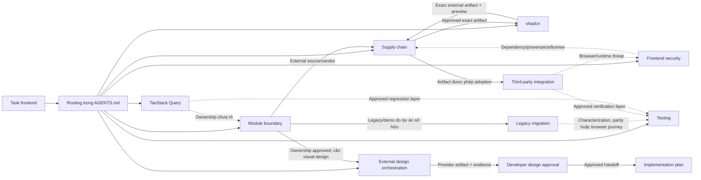

# Skill của agent

> Danh mục phân loại hiện hành nằm tại
> [`skill-catalog.md`](skill-catalog.md). Tài liệu này giải thích chi tiết cấu trúc và lịch sử của
> từng skill; khi routing task, luôn ưu tiên catalog hiện hành.

## Mục đích

Tài liệu này giải thích cách repository tổ chức và phối hợp các skill dành cho agent. Đối tượng đọc
là developer muốn:

- hiểu vì sao agent chọn một skill cho task cụ thể;
- biết mỗi file trong một skill có nhiệm vụ gì;
- biết chín skill frontend hiện tại xử lý phần việc nào;
- biết khi nào cần kết hợp nhiều skill và thứ tự kết hợp; hoặc
- tự thiết kế một skill mới mà không tạo thêm một bộ quy tắc cạnh tranh.

Tài liệu này là lớp giải thích cho con người. Nguồn vận hành vẫn là:

1. [`AGENTS.md`](../../AGENTS.md) cho routing và workflow bắt buộc của repository.
2. `SKILL.md` của từng skill cho trigger, workflow, output và guardrail.
3. [`.analysis/README.md`](../../.analysis/README.md) cùng analysis của bounded context cho quyết định
   kiến trúc đã được duyệt.
4. [`.agents/rules/frontend-coding.md`](../../.agents/rules/frontend-coding.md) cho quy tắc thay đổi
   frontend.

Nếu tài liệu này khác với nguồn vận hành, ưu tiên nguồn vận hành và cập nhật lại tài liệu.

## Skill là gì?

Skill là một gói hướng dẫn có phạm vi hẹp, giúp agent thực hiện một loại công việc chuyên biệt theo
quy trình nhất quán. Một skill tốt không thay thế toàn bộ agent và cũng không chứa mọi kiến thức của
repository. Nó thường trả lời năm câu hỏi:

1. **Khi nào dùng?** Task intent nào kích hoạt skill.
2. **Cần biết gì trước?** Authority, source, analysis, contract hoặc approval nào là đầu vào.
3. **Làm theo trình tự nào?** Các bước thu thập evidence, ra quyết định, triển khai và kiểm chứng.
4. **Trả lại gì?** Report, impact model, implementation, test hoặc handoff nào phải có.
5. **Không được làm gì?** Các gate và guardrail ngăn agent tự mở rộng quyền hoặc tự chốt kiến trúc.

Skill không phải:

- một prompt dài chứa toàn bộ kiến thức dự án;
- một module source code của sản phẩm;
- một quyền mặc định để cài package, truy cập mạng, sửa source hoặc kiểm thử hệ thống thật;
- một scanner có thể tự xác nhận mọi kết quả; hoặc
- một cách bỏ qua task tier, specialized gate hoặc developer approval đang áp dụng.

## Agent tự chọn skill như thế nào?

Developer không cần chọn skill thủ công cho task thông thường. Agent dùng phần `Frontend skill
routing` trong `AGENTS.md` để suy luận tập skill nhỏ nhất từ nội dung yêu cầu.

Trước routing, agent phân loại `review-only`, `routine change` hoặc `governed change`. Tier quyết định
độ nặng của plan/progress/testing workflow, không thay đổi ownership của skill và không được dùng để
bỏ qua gate dependency, source, design, security hoặc architecture.

Luồng chọn và nạp skill:

```text
Yêu cầu của developer
        │
        ▼
Đọc bảng routing trong AGENTS.md
        │
        ▼
Chọn tập skill nhỏ nhất và đúng thứ tự
        │
        ▼
Chỉ đọc SKILL.md đã chọn
        │
        ▼
Chỉ đọc reference cần cho nhánh hiện tại
        │
        ▼
Chạy helper khi cần evidence xác định
        │
        ▼
Tạo output, dừng ở gate hoặc bàn giao cho skill kế tiếp
```

Nguyên tắc quan trọng:

- Không quét toàn bộ `.agents/skills` để tìm ứng viên trong một task thông thường.
- Không đọc mọi reference ngay khi skill được chọn.
- Không nạp test skill chỉ vì cần chạy validation thông thường.
- Không nạp supply-chain skill cho lỗi ứng dụng không liên quan dependency hoặc source adoption.
- Nếu không có dòng routing phù hợp, agent dùng rule chung của repository mà không cần specialist
  skill.
- Việc bảo trì chính catalog skill là trường hợp đặc biệt: task đó có thể cần đối chiếu toàn bộ skill
  vì catalog là đối tượng đang được sửa hoặc tài liệu hóa.

Cách tải theo tầng này được gọi là **progressive disclosure**. Mục tiêu là giữ context nhỏ, giảm token
và chỉ đưa kiến thức chuyên sâu vào lúc nó thực sự ảnh hưởng quyết định.

## Cấu trúc folder của một skill

Cấu trúc đang được dùng trong repository:

```text
.agents/skills/<skill-name>/
├── SKILL.md                     # Bắt buộc: trigger và workflow chính
├── agents/
│   └── openai.yaml              # Bắt buộc trong pack hiện tại: metadata giao diện
├── references/                  # Theo nhu cầu: kiến thức chi tiết tải có chọn lọc
│   ├── <decision-guide>.md
│   └── <checklist>.md
└── scripts/                     # Theo nhu cầu: helper xác định, lặp lại được
    └── <helper>.mjs
```

`references` và `scripts` chỉ nên tồn tại khi có nội dung thực sự cần dùng. Tám skill hiện tại không
có `README.md`, `assets`, changelog hoặc file ví dụ riêng. Không nên tạo các folder/file đó theo thói
quen nếu workflow chưa cần.

### `SKILL.md`: entry point và workflow chính

Đây là file đầu tiên được đọc sau khi routing chọn skill. File gồm hai phần.

#### Frontmatter

Ví dụ:

```yaml
---
name: audit-frontend-security
description: Perform authorized frontend and browser security reviews...
---
```

- `name` là định danh ổn định của skill. Tên này phải khớp tên folder và tên dùng trong routing.
- `description` mô tả trigger bằng ngôn ngữ đủ rõ để agent phân biệt skill với các skill lân cận.
  Đây là metadata quan trọng nhất cho việc tự nội suy trước khi đọc body.

Một `description` tốt phải nói cả phạm vi dương lẫn ranh giới quan trọng. Ví dụ security skill xử lý
browser/session threat, còn dependency provenance và license được chuyển cho supply-chain skill.

#### Body

Body chứa workflow thực thi. Các skill hiện tại thường có:

- `Goal`: kết quả tổng quát cần đạt.
- Phần authority/context: nguồn nào phải đọc, quyền nào phải xác nhận và điều kiện nào buộc dừng.
- `Workflow`: các bước có thứ tự dependency.
- `Output contract`: thông tin tối thiểu agent phải trả lại.
- `Compose only as required`: quan hệ bàn giao hoặc phối hợp với skill khác.
- `Guardrails`: hành động hoặc kết luận bị cấm.

`SKILL.md` nên đủ ngắn để đọc khi skill được chọn. Decision matrix, checklist dài hoặc schema chi tiết
nên chuyển xuống `references`.

### `agents/openai.yaml`: metadata giao diện

Cấu trúc hiện tại:

```yaml
interface:
  display_name: 'Audit Frontend Security'
  short_description: 'Find and report frontend security weaknesses'
  default_prompt: 'Use $audit-frontend-security to perform an authorized evidence-backed frontend security review.'
```

Vai trò của từng field:

| Field               | Vai trò                                                |
| ------------------- | ------------------------------------------------------ |
| `display_name`      | Tên thân thiện hiển thị trong UI hoặc danh sách skill. |
| `short_description` | Mô tả ngắn để người dùng nhận biết mục đích.           |
| `default_prompt`    | Prompt khởi đầu khi người dùng chủ động gọi skill.     |

File này là metadata cho lớp giao diện, không phải workflow và không cấp thêm quyền. Agent tự routing
từ `AGENTS.md` và frontmatter của `SKILL.md`; người dùng không bắt buộc phải chọn skill trong UI. Nếu
`openai.yaml` mô tả khác `SKILL.md`, phải sửa metadata cho đồng bộ, không lấy metadata thay workflow.

### `references/*.md`: kiến thức tải theo nhu cầu

Reference chứa nội dung chuyên sâu mà không phải lần gọi skill nào cũng cần, chẳng hạn:

- decision matrix;
- checklist evidence;
- schema report;
- lựa chọn chiến lược;
- quy tắc cho một runtime hoặc test layer cụ thể; hoặc
- tiêu chí cutover, rollback và removal.

`SKILL.md` phải nói rõ lúc nào đọc reference. Agent không nên tự đọc tất cả reference chỉ vì chúng
tồn tại. Reference hiện tại chỉ nằm một tầng dưới skill, nhờ đó không tạo chuỗi liên kết sâu và khó
kiểm soát context.

Reference không được tự tạo ra quyết định kiến trúc mới. Nó giúp agent so sánh lựa chọn bằng evidence;
approval gate trong `AGENTS.md`, analysis và `SKILL.md` vẫn giữ nguyên.

### `scripts/*.mjs`: helper thu thập evidence

Script được thêm khi thao tác kiểm kê bằng tay dễ bỏ sót, khó lặp lại hoặc khó so sánh. Hai helper hiện
có dùng Node.js built-in, chạy deterministic, offline và read-only:

| Helper                          | Nhiệm vụ                                                                                                                 | Không làm                                                                                     |
| ------------------------------- | ------------------------------------------------------------------------------------------------------------------------ | --------------------------------------------------------------------------------------------- |
| `inventory-frontend-source.mjs` | Kiểm kê manifest, loại file, import, worker, WASM và dấu hiệu runtime trong một source tree.                             | Không chọn bounded context, không đề xuất kiến trúc và không ghi file output.                 |
| `inspect-js-supply-chain.mjs`   | Thu thập evidence từ JavaScript manifest và npm lockfile, gồm dependency declaration, lifecycle script và package entry. | Không liên hệ registry, không tạo SBOM, không kết luận license compliance hoặc vulnerability. |

Hai helper hỗ trợ Markdown và JSON để agent có thể đọc hoặc xử lý kết quả. Kết quả script chỉ là
evidence kỹ thuật; agent vẫn phải đối chiếu business semantics, provenance, runtime applicability và
giới hạn coverage trước khi đưa ra kết luận.

Một helper trong tương lai chỉ nên được thêm khi:

1. thao tác có quy tắc xác định và lặp lại;
2. output có thể kiểm chứng;
3. side effect và quyền cần thiết được ghi rõ;
4. script không thay thế judgment cần approval; và
5. lỗi, dữ liệu không hỗ trợ và giới hạn coverage được báo minh bạch.

## Vòng đời một lần sử dụng skill

### 1. Nhận diện trigger

Agent đọc task intent và bảng routing. Kết quả phải là không có specialist skill, một skill, hoặc một
chuỗi skill có thứ tự rõ ràng.

### 2. Nạp authority

Skill đọc `AGENTS.md`, active task scope, project analysis và rule liên quan. Approved plan chỉ bắt
buộc khi task tier hoặc mutation yêu cầu nó. Tài liệu Next.js chỉ được đọc khi quyết định thực sự liên
quan API/framework behavior.

### 3. Xác nhận input và quyền

Agent xác định source root, target, người tiêu thụ, môi trường, quyền đọc/ghi, quyền truy cập mạng,
quyền cài package hoặc quyền active testing. Công cụ đang có không tự mở rộng authority.

### 4. Thu thập evidence

Agent đọc source/config liên quan, reference cần thiết và có thể chạy helper read-only. Evidence phải
được phân biệt với suy luận và phần chưa kiểm chứng.

### 5. Thực hiện workflow

Agent đi theo thứ tự trong `SKILL.md`. Inspect-only có thể thu thập evidence cho impact model; mutation
chỉ thực hiện trong scope đã được tier và approval cho phép.

### 6. Áp dụng gate

Nếu thiếu ownership, license, authorization, test framework, integration mode hoặc quyết định kiến
trúc, skill phải dừng ở trạng thái phù hợp. Dừng không đồng nghĩa thất bại; đây là cơ chế ngăn agent
tự quyết thay developer.

### 7. Trả output hoặc handoff

Output của một skill có thể kết thúc task hoặc trở thành input đã được duyệt cho skill kế tiếp. Handoff
phải nêu evidence, quyết định, unknown, owner và gate còn lại; không chỉ ghi “đã xử lý”.

## Danh mục skill hiện tại

### 1. `design-frontend-module-boundary`

Nguồn: [`SKILL.md`](../../.agents/skills/design-frontend-module-boundary/SKILL.md)

**Khi dùng**

- Có source legacy, demo, clone hoặc capability mới nhưng chưa rõ bounded context sở hữu.
- Chưa rõ trách nhiệm thuộc domain/application, module presentation, shared UI, delivery hay adapter.
- Cần xác định có thật sự phải tạo module mới hay không.

**Công việc chính**

1. Cố định source boundary và requested capability.
2. Thu thập inventory, business vocabulary, consumer, contract, state và runtime evidence.
3. Phân loại từng responsibility theo DDD và UI/delivery/integration concern.
4. So sánh existing context, proposed context, adapter, shared UI hoặc reject/isolate.
5. Tạo responsibility map, dependency map và source-to-target placement table.

**Reference và helper**

- `references/intake-evidence.md`: danh mục evidence đầu vào và dependency seam.
- `references/ownership-and-placement.md`: decision matrix cho ownership, DDD placement và gate.
- `scripts/inventory-frontend-source.mjs`: inventory read-only cho source tree.

**Output và gate**

Output gồm evidence, ownership options, phương án bị loại, impact model, unknown và validation
strategy. Kết quả chỉ được chuyển sang implementation plan khi là
`ready-for-implementation-plan`. Nếu chưa đủ, dừng ở `architecture-approval-required` hoặc
`more-evidence-required`.

**Tương tác**

- Bàn giao sang `migrate-legacy-frontend-module` khi source là code cũ do dự án sở hữu.
- Bàn giao theo thứ tự `audit-frontend-supply-chain` rồi `integrate-third-party-frontend` khi source
  bên ngoài hoặc có vendor runtime.

### 2. `migrate-legacy-frontend-module`

Nguồn: [`SKILL.md`](../../.agents/skills/migrate-legacy-frontend-module/SKILL.md)

**Khi dùng**

- Di chuyển behavior từ frontend legacy/demo/freestyle sang module DDD đã được duyệt.
- Mục tiêu là bảo toàn hành vi có chủ đích, không phải tự động rewrite hoặc cleanup toàn bộ.

**Điều kiện đầu vào**

Phải có kết quả boundary đã duyệt, nêu rõ context đích, layer, consumer và vấn đề chưa quyết định.
Nếu evidence mới làm thay đổi ownership, quay lại boundary skill và plan approval.

**Công việc chính**

1. Chụp baseline behavior và phân biệt known bug được giữ hay thay đổi đã duyệt.
2. Lộ dependency seam, side effect, global state, browser/vendor coupling và temporary bridge.
3. So sánh chiến lược migration bằng evidence thay vì mặc định big-bang hoặc vertical slice.
4. Chia migration unit theo dependency, kèm coexistence, cutover, rollback và removal gate.
5. Triển khai đúng unit được duyệt và kiểm chứng parity trước khi xóa legacy.

**Reference**

- `references/characterization-and-cutover.md`: baseline, parity matrix, coexistence và cutover.
- `references/migration-strategy-options.md`: lựa chọn chiến lược và decision record.

**Output và gate**

Output gồm target, strategy, migration-unit sequence, parity evidence, changed files, trạng thái
cutover/rollback/removal và debt còn lại. Compile thành công không đủ để tuyên bố parity. Legacy chỉ
được xóa sau khi consumer và nghĩa vụ rollback đã được giải quyết.

**Tương tác**

- Đứng sau `design-frontend-module-boundary`.
- Thêm `testing` sau Decision Gate khi cần characterization, regression hoặc browser journey.
- Không dùng thay cho third-party adoption workflow.

### 3. `audit-frontend-supply-chain`

Nguồn: [`SKILL.md`](../../.agents/skills/audit-frontend-supply-chain/SKILL.md)

**Khi dùng**

- Đánh giá dependency, package, clone source, fork hoặc artifact trước adoption/upgrade/vendoring.
- Cần evidence về identity, provenance, license, lockfile, integrity, lifecycle script, advisory,
  SBOM, maintenance, update hoặc exit risk.

**Công việc chính**

1. Cố định exact package/version/commit/artifact và decision đang được hỏi.
2. Thu thập manifest/lockfile/license/notice/patch/binary evidence offline trước.
3. Đánh giá provenance, install surface, owner, update, rollback và exit plan.
4. Chỉ chạy scanner hoặc tạo SBOM khi nằm trong scope và có authority phù hợp.
5. Tách observed fact, advisory/policy finding, runtime applicability và unknown coverage.

**Reference và helper**

- `references/dependency-adoption-checklist.md`: identity, license, maintenance và recommendation.
- `references/scanner-and-sbom-routing.md`: cách chọn scanner/SBOM và diễn giải giới hạn.
- `scripts/inspect-js-supply-chain.mjs`: evidence offline từ manifest/npm lockfile.

**Output và gate**

Trả một recommendation có điều kiện: `adopt`, `adopt-with-controls`, `hold` hoặc `reject`, kèm evidence
và unknown. Không được đánh dấu sẵn sàng adoption khi thiếu artifact identity, license review hoặc
approval quan trọng. Lockfile integrity không chứng minh publisher identity hay code safety.

**Tương tác**

- Đứng giữa boundary và third-party integration trong luồng nhận source bên ngoài.
- Nhận handoff từ security khi câu hỏi chuyển sang dependency/provenance/license.
- Chuyển browser/application threat sang `audit-frontend-security`.

### 4. `integrate-third-party-frontend`

Nguồn: [`SKILL.md`](../../.agents/skills/integrate-third-party-frontend/SKILL.md)

**Khi dùng**

- Onboard open-source/vendor frontend, SDK, widget, 2D/3D engine, mapping runtime hoặc cloned repo.
- Cần chọn package, wrapper, vendored source, iframe, deployment riêng hoặc reimplementation.
- Có concern về CSS, worker, WASM/WebGL, asset, CSP, lifecycle, update hoặc removal.

**Điều kiện đầu vào**

Phải có boundary đã duyệt và supply-chain evidence cho exact artifact. Thiếu license/provenance,
update owner hoặc permitted integration mode thì dừng; quyền clone không phải quyền vendor/install.

**Công việc chính**

1. Cố định artifact, feature cần dùng và feature upstream bị loại.
2. Chọn integration mode, ghi cả phương án bị loại.
3. Thiết kế internal capability contract, mapper và vendor boundary hẹp.
4. Xử lý client/server, CSS/DOM, portal, worker, WASM/WebGL, asset, CSP, network và cleanup.
5. Tích hợp vào owning module qua adapter, sau đó mới compose route/template.
6. Định nghĩa update, patch ownership, rollback, removal và exit criteria.

**Reference**

- `references/integration-mode-decision.md`: các mode và tiêu chí lựa chọn.
- `references/runtime-and-vendor-isolation.md`: framework, contract, CSS, runtime và validation.

**Output và gate**

Output gồm exact source identity, adoption decision, integration mode, internal contract, runtime
boundary, artifact/config impact, owner, validation, rollback và removal. Vendor engine không được
đặt trong domain chỉ vì nó lớn hoặc quan trọng với sản phẩm.

**Tương tác**

- Luôn theo sau `design-frontend-module-boundary` và `audit-frontend-supply-chain` trong adoption
  flow.
- Thêm `audit-frontend-security` cho browser/runtime threat.
- Thêm skill test khi tầng kiểm chứng tương ứng thực sự nằm trong scope.

### 5. `audit-frontend-security`

Nguồn: [`SKILL.md`](../../.agents/skills/audit-frontend-security/SKILL.md)

**Khi dùng**

- Review XSS, CSRF, CSP, URL/input/output, token, cookie, session, storage hoặc permission assumption.
- Review browser messaging, realtime channel, upload, worker hoặc third-party runtime threat.
- Cần source/config review, safe scanner selection, remediation guidance hoặc retest.

**Điều kiện đầu vào**

Phải ghi rõ requester, target, role/account, method, data, environment, thời gian và exclusion. Source
review, passive inspection, active testing, remediation và retest là các quyền khác nhau. Công cụ hoặc
credential sẵn có không tự mở rộng scope.

**Công việc chính**

1. Tạo threat model cục bộ theo asset, actor, trust boundary, entry point và control owner.
2. Trace untrusted data và token/session lifecycle qua source, request, storage, message và sink.
3. Chọn static/passive check trước; active test chỉ khi được phép.
4. Phân biệt confirmed, likely và needs-verification; đánh giá precondition, impact và severity.
5. Đề xuất remediation nhỏ nhất, sau đó retest đúng condition và bypass representative.

**Reference**

- `references/browser-threat-matrix.md`: threat surface và threat-model record.
- `references/security-evidence-and-reporting.md`: authorization, finding schema, report và retest.

**Output và gate**

Output là finding có evidence, location, precondition, impact, severity rationale, remediation owner,
retest và coverage limit. Scanner alert không tự trở thành confirmed vulnerability. Frontend permission
check không được gọi là security boundary của server.

**Tương tác**

- Thêm `audit-frontend-supply-chain` chỉ cho dependency, lockfile, provenance hoặc license.
- Thêm test skill khi remediation cần regression test đúng tầng.
- Không biến Playwright self-test thành penetration test.

### 6. `testing`

Nguồn: [`SKILL.md`](../../.agents/skills/testing/SKILL.md)

**Khi dùng**

- Thiết kế, viết, chạy, debug hoặc review unit, component, integration, contract, API hoặc E2E test.
- Chỉ dùng khi test layer nằm trong scope hoặc developer đã chọn `yes` ở Decision Gate.
- Routine lint, typecheck, build hoặc browser validation không tự kích hoạt skill này.

**Điều kiện đầu vào**

Phải đọc `.agents/rules/testing.md`, Decision Gate, package/config/setup hiện tại, behavior contract và
source seam đang được kiểm chứng. Rule testing sở hữu placement, naming, fixture/mock và documentation
workflow; ví dụ generic trong reference không cho phép tự cài hoặc cấu hình lại test runner.

**Công việc chính**

1. Chọn tầng thấp nhất chứng minh được behavior: unit, component, integration/contract hoặc E2E.
2. Xác định observable contract và tránh assertion vào private implementation.
3. Mock external/unstable seam, kiểm soát network, time, randomness, storage và authentication.
4. Chỉ nạp reference đúng layer hoặc vấn đề đang debug.
5. Chạy targeted test trước, sau đó validation bắt buộc của repository.
6. Cập nhật feature docs và behavior matrix theo `AGENTS.md` và testing rule.

**Reference**

- Unit/integration: `unit-testing.md`, `integration-testing.md`.
- E2E/browser: `nextjs.md`, `react.md`, `locators.md`, `assertions-and-waiting.md`.
- Theo nhu cầu: `configuration.md`, `authentication.md`, `api-testing.md`,
  `network-mocking.md`, `debugging.md`.

**Output và gate**

Output gồm behavior source, layer được chọn, fixture/mock boundary, files, commands/results, artifact,
coverage limit và residual risk. Không tạo test trước Decision Gate và không hoàn thành khi test vừa tạo
chưa được chạy bằng runner đang cấu hình.

**Tương tác**

- Được thêm vào migration khi cần characterization/parity đã duyệt.
- Được thêm vào integration/security/TanStack Query khi regression layer tương ứng đã duyệt.
- Một skill duy nhất route nhiều test layer; không còn hai skill unit và Playwright riêng.

### 7. `nextjs-tanstack-query`

Nguồn: [`SKILL.md`](../../.agents/skills/nextjs-tanstack-query/SKILL.md)

**Khi dùng**

- Task yêu cầu rõ TanStack Query hoặc sửa flow query/mutation/hydration đang tồn tại.
- Cần quyết định task-local về query key, cache, invalidation, optimistic update hoặc hydration.
- Tra cứu Tier-1 **Production Decision Matrix (18 use-cases)** để chọn nhanh pattern phù hợp (GET List/Detail, Infinite Query, Debounced Search, SSR Hydration single/parallel/searchParams, Auth Bootstrap, POST/PATCH/DELETE Cache Invalidation/Direct Insert/Eviction/Optimistic Update, Route Prefetch, Refetch, Error Boundaries).
- Không dùng làm data-fetching mặc định cho mọi Server Component hay React state thông thường.

**Quy định cấu trúc DDD (Presentation Seam)**

Query và Mutation bindings bắt buộc thuộc tầng **Presentation** của Bounded Context:

```text
src/modules/<context>/
└── presentation/
    ├── queries/                   # Typed queryOptions factories & read hooks (useQuery)
    │   ├── user-keys.ts           # Query key factory
    │   └── get-users.query.ts     # queryOptions & useUsersQuery hook
    ├── mutations/                 # Typed useMutation hooks & cache management
    │   └── create-user.mutation.ts # useCreateUserMutation hook
    └── components/                # UI components consuming presentation query hooks
```

**Điều kiện đầu vào**

Phải đọc analysis, context sở hữu, `react-state-runtime.md`, provider hiện có, application/infrastructure seam, ESLint config và consumer. Khi policy cần thiết còn deferred, dừng ở `tanstack-query-architecture-approval-required`.

**Công việc chính**

1. Tra cứu **Production Decision Matrix** trong `SKILL.md` để chọn API và cache strategy phù hợp trong 10 giây.
2. Phân biệt server state với local/form/URL/business state.
3. Giữ dependency `presentation -> application <- infrastructure`; presentation không import adapter implementation trực tiếp.
4. Tách biệt Client `browserQueryClient` với Server Request-Scoped `getQueryClient()` (dùng React `cache()`) để bảo đảm data isolation giữa các requests.
5. Thực thi Proactive Skill Evolution Protocol: Khi gặp use-case mới chưa có trong Decision Matrix, phát thông báo hỏi developer để bổ sung vào skill catalog.

**Reference**

- `references/query-patterns.md`: 13 TypeScript code recipes cho Client CRUD, Invalidation, Optimistic updates, Eviction, Infinite Query, Debounced search, Route prefetch.
- `references/hydration.md`: 5 TypeScript code recipes cho Server Prefetch (`Promise.all`, dynamic `searchParams`, Auth bootstrap layout).

---

### 8. `shadcn`

Nguồn: [`SKILL.md`](../../.agents/skills/shadcn/SKILL.md)

**Khi dùng**

- Task trực tiếp yêu cầu shadcn CLI, preset, registry inspection, docs hoặc một primitive chính thức.
- Implementation đã được duyệt cần thêm, cập nhật, debug, style hoặc compose một shadcn primitive.

Không trigger skill chỉ vì repository có `components.json`.

**Ranh giới và handoff**

- `AGENTS.md`, `.analysis` và frontend topic rules vẫn quyết định ownership, Atomic placement, public API, design token, accessibility và validation.
- Skill có `inspect-only` và `approved mutation`. `info`, docs/search/view, `add --dry-run` và targeted
  `--diff` được dùng trước implementation approval để xác định exact impact; mọi mutation phải khớp
  preview đã duyệt và dừng khi có drift.
- `@shadcn` là nguồn primitive chính thức. Community namespace, GitHub registry và nguồn cấu hình
  khác đi theo `shadcn inspect-only -> supply-chain audit -> approval -> shadcn apply`.
- Official primitive vẫn phải handoff khi preview phát hiện package, install script, global CSS,
  asset, worker, runtime hoặc browser threat mới.
- `mcp.md` chỉ được load khi shadcn MCP đang available/configured và nằm rõ trong scope.
- Thêm `integrate-third-party-frontend` cho feature-level runtime/global integration; thêm `audit-frontend-security` khi có browser threat surface.
- Skill shadcn không tự quyết design, bounded context, TanStack Query policy hoặc test. Decision Gate và test layer theo workflow chung của repository.

---

### 9. `orchestrate-frontend-design`

Nguồn: [`SKILL.md`](../../.agents/skills/orchestrate-frontend-design/SKILL.md)

**Khi dùng**

- Task cần tạo hoặc chỉnh sửa visual UI/UX nhưng chưa có design artifact được developer duyệt.
- Cần tổng hợp requirement, analysis, source và document thành prompt hoàn chỉnh hoặc prompt chain.
- Cần điều phối một external designer qua MCP/plugin và nhận image, HTML, design file, node hoặc
  provider artifact có thể truy vết.

Không dùng skill này để quyết định DDD ownership, tự xây visual solution, hoặc implement code từ một
design đã được duyệt.

**Điều kiện đầu vào**

Task plan phải duyệt phạm vi design execution và context được phép gửi ra ngoài. Agent phải xác định
project authority, context liên quan, artifact cần nhận và live capability của provider. Một tool chỉ
cho phép agent tự vẽ node hoặc import code-to-canvas không tự động được coi là external designer.

**Công việc chính**

1. Tạo context packet tối thiểu, tách requirement, observed evidence, reference, provider choice và
   unknown.
2. Chọn provider theo capability đang được discover và chỉ nạp reference của provider đó.
3. Chọn single prompt hoặc chuỗi prompt có stage, dependency, response ID và exit condition rõ ràng.
4. Gọi provider qua MCP/plugin, kiểm tra artifact thật và chỉ yêu cầu sửa theo mismatch có evidence.
5. Chuẩn hóa project/screen/file/node ID, image/HTML/link, prompt checkpoint, unknown và downstream
   constraint thành design handoff.
6. Dừng trước application code để developer duyệt artifact cụ thể.

**Reference**

- `references/prompt-orchestration.md`: context packet, single prompt, prompt chain, correction loop
  và exit gate.
- `references/design-handoff.md`: contract chuẩn hóa artifact và handoff sang implementation.
- `references/stitch.md`: adapter Google Stitch.
- `references/figma.md`: adapter Figma/Figma AI và gate phân biệt provider design với agent-authored
  canvas work.

**Output và gate**

Output gồm provider/channel, context đã gửi và loại bỏ, toàn bộ prompt/response checkpoint, artifact
ID/link/preview, objective check, generated-code assumptions và downstream route. Kết quả thành công
dừng ở `design-approval-required`. Provider thiếu, chưa auth, không có external-design capability
hoặc không trả artifact evidence phải dừng ở gate tương ứng; agent không tự tạo visual thay thế.

**Tương tác**

- Chạy `design-frontend-module-boundary` trước khi ownership hoặc placement chưa rõ.
- Sau khi developer duyệt artifact, tạo hoặc sửa implementation plan rồi dùng rule/skill frontend
  phù hợp với scope code.
- Design-provider MCP/plugin là agent tooling, không đồng nghĩa với việc application đang adopt một
  third-party runtime qua `integrate-third-party-frontend`.

## Quan hệ giữa các skill



Đường liền thể hiện handoff chính có thứ tự. Đường chấm là skill chỉ được thêm khi scope/evidence yêu
cầu; chúng không phải bước mặc định.

### Luồng external frontend design

```text
design-frontend-module-boundary (chỉ khi ownership chưa rõ)
    -> developer duyệt ownership
    -> orchestrate-frontend-design
    -> external designer qua MCP/plugin
    -> developer duyệt design artifact
    -> implementation plan và frontend skill phù hợp
```

Agent chuẩn bị context và prompt, còn provider chịu trách nhiệm visual solution. Nếu design artifact
đã được developer duyệt từ trước, bỏ qua orchestration và đi thẳng vào implementation planning. HTML
hoặc code do provider trả về vẫn là design evidence, không phải production source.

### Luồng migration

```text
design-frontend-module-boundary
    -> developer duyệt ownership
    -> migrate-legacy-frontend-module
    -> test skill phù hợp nếu tầng test nằm trong scope
```

Boundary skill quyết định code thuộc đâu. Migration skill quyết định cách di chuyển behavior vào nơi
đã duyệt. Test skill chứng minh baseline/parity ở tầng thích hợp; nó không tự quyết ownership.

### Luồng third-party/open-source

```text
design-frontend-module-boundary
    -> audit-frontend-supply-chain
    -> developer duyệt artifact và integration mode
    -> integrate-third-party-frontend
    -> security/test skill khi threat hoặc verification nằm trong scope
```

Boundary xác định business ownership. Supply-chain xác định có nên nhận exact artifact hay không.
Integration cô lập vendor runtime khỏi domain. Security kiểm tra threat ứng dụng/browser; test skill
kiểm chứng behavior đã duyệt.

### Luồng security

```text
audit-frontend-security
    -> audit-frontend-supply-chain chỉ khi finding liên quan dependency/provenance/license
    -> test skill chỉ khi tạo regression test đã được duyệt
```

Security và supply-chain không thay thế nhau. Một package có provenance/lockfile tốt vẫn có thể bị dùng
sai và gây XSS/token leak; ngược lại source application an toàn không chứng minh package license hay
publisher identity.

### Phân chia layer trong skill `testing`

| Câu hỏi cần chứng minh                        | Layer do `testing` chọn |
| --------------------------------------------- | ----------------------- |
| Hàm/algorithm trả kết quả đúng?               | Unit                    |
| Component phản ứng đúng với state/props?      | Component               |
| Contract hoặc legacy behavior cần baseline?   | Integration/contract    |
| Người dùng hoàn thành journey qua route thật? | E2E browser             |
| Cần screenshot/trace/video để debug journey?  | E2E artifact            |

Không lặp cùng một assertion ở mọi tầng. Browser test chỉ dành cho hành vi cần browser integration;
logic thuần nên được kiểm chứng ở tầng thấp hơn. Tất cả layer đều đi qua một `testing` skill và
Decision Gate của repository.

## Kịch bản phối hợp điển hình

| Yêu cầu                                                           | Route tối thiểu                                            | Lý do                                                         |
| ----------------------------------------------------------------- | ---------------------------------------------------------- | ------------------------------------------------------------- |
| “Đưa demo cũ vào module Mission” nhưng ownership chưa có evidence | Boundary -> Migration sau approval                         | Không để tên task tự quyết bounded context.                   |
| Clone một mapping/WebGL repo và đưa vào sản phẩm                  | Boundary -> Supply-chain -> Integration                    | Tách business ownership, adoption risk và vendor runtime.     |
| Review token refresh và logout                                    | Security                                                   | Không cần supply-chain nếu không có câu hỏi dependency.       |
| Kiểm tra package trước khi nâng version                           | Supply-chain                                               | Chưa có yêu cầu onboarding hay browser threat.                |
| Thêm primitive chính thức `@shadcn/dialog` đã nằm trong plan      | Shadcn                                                     | CLI/docs/composition là phạm vi trực tiếp của skill.          |
| Nhận login block từ community/GitHub registry                     | Shadcn inspect -> Supply-chain -> approval -> Shadcn apply | Cần exact artifact trước audit; audit không tự cấp quyền add. |
| Viết test cho thuật toán chuyển tọa độ                            | Testing (unit)                                             | Hành vi thuần, không cần browser journey.                     |
| Viết login E2E và thu trace khi fail                              | Testing (E2E)                                              | Cần route và browser thật.                                    |
| Tích hợp external map rồi kiểm tra journey người dùng             | Boundary -> Supply-chain -> Integration -> Testing         | E2E chỉ được thêm ở verification phase sau Decision Gate.     |
| Thêm mutation TanStack Query cho một module                       | TanStack Query -> architecture approval -> implementation  | Cache/invalidation policy đang deferred, không tự suy diễn.   |
| Tạo UI mới khi chưa có design artifact được duyệt                 | Orchestration -> design approval -> implementation plan    | External provider tạo visual; agent chỉ điều phối.            |
| Implement từ Figma/image/artifact đã được developer duyệt         | Implementation plan và skill đúng scope                    | Không gọi provider lại khi design đầu vào đã được duyệt.      |

## Gate và handoff

Mỗi skill có thể trả ba loại kết quả:

1. **Ready:** đủ evidence và approval để lập/tiếp tục implementation plan.
2. **Conditional:** có hướng đề xuất nhưng còn control, unknown hoặc approval cần giải quyết.
3. **Stop:** thiếu authority, ownership, artifact identity, framework/setup hoặc quyết định kiến trúc.

Khi handoff, skill trước cần cung cấp một record ngắn, tối thiểu:

- phạm vi, exact source/artifact và version/commit;
- evidence đã dùng và giới hạn;
- quyết định đã duyệt cùng phương án bị loại;
- owner/context/layer hoặc control owner;
- unknown và deferred decision;
- file/dependency/consumer và runtime-surface impact;
- validation, rollback hoặc removal gate liên quan; và
- approval state, reference đã đọc và việc skill sau được phép hoặc chưa được phép làm.

Skill sau không được suy diễn rằng việc nhận handoff đồng nghĩa mọi quyền đã được cấp.

## Anti-pattern cần tránh

- Đọc toàn bộ skill catalog trong mọi task để “chắc chắn”.
- Tạo một frontend super-skill lặp lại toàn bộ DDD, security, API và test guidance.
- Chép reference dài vào `SKILL.md`, khiến mọi invocation phải trả token cho nội dung không dùng.
- Dùng `openai.yaml` làm nguồn workflow hoặc authorization.
- Xem helper output là quyết định kiến trúc, legal opinion hoặc security conclusion.
- Dùng migration skill để hợp thức hóa một bounded context chưa được duyệt.
- Dùng third-party integration trước khi cố định exact artifact và adoption evidence.
- Dùng security skill như quyền mặc định để active scan hoặc pentest.
- Tự cài test framework/Playwright khi setup gate chưa được duyệt.
- Thêm mọi test skill chỉ vì plan có bước “validation”.
- Tạo compatibility adapter, fork hoặc baseline mà không có owner và removal/update policy.
- Để agent tự tạo visual khi provider không khả dụng, coi provider HTML/code là production source,
  hoặc đồng nhất design-provider MCP/plugin với `integrate-third-party-frontend`.

## Khi thêm hoặc sửa skill

Catalog phải được cập nhật như một contract đồng bộ:

1. Xác định trigger và ranh giới với skill lân cận.
2. Cập nhật frontmatter `name`/`description` trong `SKILL.md`.
3. Giữ workflow chính ngắn và chuyển chi tiết theo nhánh xuống `references`.
4. Chỉ thêm script khi có thao tác deterministic cần tái sử dụng.
5. Đồng bộ `agents/openai.yaml` với skill nhưng không đưa workflow vào metadata UI.
6. Cập nhật bảng routing trong `AGENTS.md` nếu catalog hoặc composition thay đổi.
7. Cập nhật tài liệu này để developer hiểu skill mới và handoff của nó.
8. Validate cấu trúc, link, script và natural-language routing trước khi hoàn tất.

Không nên thêm skill chỉ vì một task có tên mới. Một skill mới hợp lý khi công việc có trigger ổn định,
workflow lặp lại, output contract riêng và ranh giới rõ với các skill đang có.
