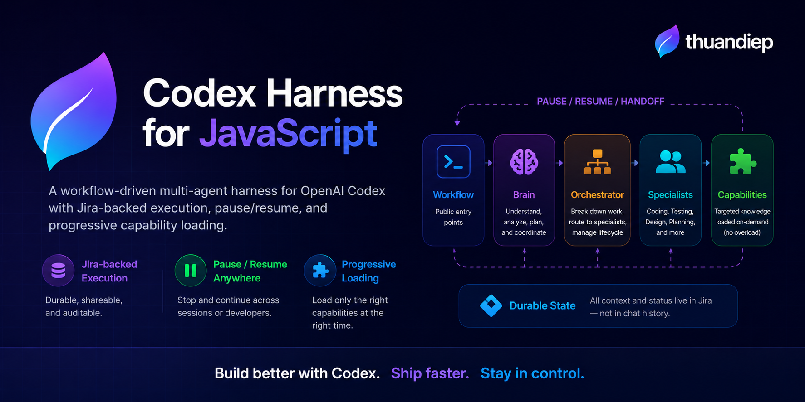

# Codex Harness for JavaScript

[](https://github.com/thuandiep1707/codex-harness-javascript/releases)
[](LICENSE)
[](https://github.com/thuandiep1707/codex-harness-javascript/generate)
[](https://github.com/thuandiep1707/codex-harness-javascript)

A workflow-driven multi-agent harness for OpenAI Codex that turns product docs and current source into Jira-backed planning, implementation, testing, pause/resume handoff, and final acceptance.

**Public workflows:** `$frontend-delivery` · `$frontend-planning`

> This repository is a declarative control plane, not a standalone agent runtime. Codex provides the execution environment; this repository provides workflows, agent behavior, rules, protocols, and progressively loaded capability knowledge.

## Architecture Overview

<p align="center">
  
</p>

This overview shows how public workflows move through Brain, Orchestrator, Specialists, internal Capabilities, and Jira-backed durable state across the full delivery lifecycle.

## Why this exists

Long-running AI coding work becomes unreliable when important context lives only in chat history.

A session can end. A different developer may continue the work. Requirements can change after planning. Multiple specialists may need different context. A project may already use MUI, HeroUI, Radix, TanStack Query, Zustand, or another stack that should not be silently replaced by a hard-coded default.

This harness is built around four ideas:

- workflow state should survive chat sessions and developer handoffs;
- users should launch complete workflows, not dozens of internal skills;
- specialists should receive bounded context and load only the knowledge they need;
- existing project evidence should drive implementation routing instead of library assumptions.

## What makes it different

| Principle | What it means |
| --- | --- |
| **Workflow-first interface** | Only complete user-facing workflows appear in the `$` picker. Internal capabilities stay private. |
| **Jira-backed execution context** | Jira stores durable work state, results, handoffs, and continuation context instead of relying on chat memory. |
| **Pause / Resume by design** | A natural-language pause request creates a durable handoff before the workflow stops. A later session resumes from the smallest valid Jira context. |
| **Progressive capability loading** | Agents load only routed capabilities for the current subtask instead of loading the whole knowledge base. |
| **Evidence-based stack discovery** | The harness inspects the existing project before routing UI, state, data, testing, or framework capabilities. |
| **Strict agent boundaries** | Brain reasons about requirements, Orchestrator owns Jira and routing, Specialists execute bounded work. |
| **Acceptance beyond green tests** | Completion requires final acceptance against authoritative docs, Jira context, source changes, and validation evidence. |

## Quick Start

### 1. Use the template or clone the repository

Use **Use this template** on GitHub, or clone the repository as your control project.

No runtime package needs to be installed for the harness itself.

### 2. Open the harness and your product project in the same workspace

```text
workspace/
├── codex-harness-javascript/   ← primary / control repo
└── your-product-project/       ← working repo
```

The control repo owns agent behavior. The product repo owns product docs and implementation source.

### 3. Provide the required external context

For the bundled frontend workflows:

- keep authoritative product documentation under the product project's `.docs/` surface;
- make the current product source available in the same workspace;
- connect Jira so the harness can persist planning, execution state, results, pause handoffs, and resume context;
- connect optional design providers only when the requested work requires them.

The harness does not store credentials or silently install external integrations.

### 4. Launch a workflow

Planning only:

```text
$frontend-planning
Break the current recruitment scope into Jira work. Do not implement it yet.
```

End-to-end delivery:

```text
$frontend-delivery
Implement the recruitment scope from .docs end-to-end.
```

`$frontend-delivery` does **not** stop just because Jira Tasks/Subtasks were created. It continues through dependency-ready specialist work, testing, reconciliation, and final acceptance unless it reaches a real blocker, approval gate, or explicit pause.

## Example

```text
$frontend-delivery
Implement user management from the approved product docs.
```

The workflow resolves the current lifecycle entry and then coordinates the system:

```text
.docs + current source
        ↓
Brain
requirement analysis + project-stack discovery
        ↓
Orchestrator
Jira Feature → Task → Specialist Subtask
        ↓
Design / Test Plan when required
        ↓
Coding
        ↓
Testing
        ↓
Reconciliation
        ↓
Brain Acceptance
        ↓
Accepted
```

If the work is interrupted:

```text
"pause here"
    ↓
stop new dispatch
    ↓
reconcile current results
    ↓
persist Jira [HANDOFF]
    ↓
paused
```

A later session can resume without depending on the previous chat transcript.

## Public Workflows

Only packages under `.agents/skills/` are user-facing workflow entry points.

| Workflow | Purpose |
| --- | --- |
| `$frontend-delivery` | Run frontend work end-to-end from authoritative docs/source through Jira planning, specialist execution, testing, reconciliation, and final acceptance. |
| `$frontend-planning` | Analyze the requested frontend scope, create the Jira Feature/Task/Subtask graph, and stop before implementation. |

Everything else is internal capability knowledge and should not appear in the `$` picker.

## How the Harness Works

### Truth model

```text
Control repo   = Workflow + Agent Behavior Truth
.docs          = Product Truth
Jira           = Work + Execution Context Truth
Product source = Implementation Truth
```

Chat history is never workflow truth.

The product repository does not need a second hidden workflow database such as `.plans/`, `.progresses/`, or `.agent/` state folders.

### Execution intent and lifecycle are separate

```text
Execution intent
├── plan-only
└── deliver

Lifecycle entry
├── NEW
├── RESUME
├── REPLAN
├── PAUSE
└── ACCEPTANCE
```

Examples:

```text
$frontend-delivery + NEW
→ Brain → Jira planning → specialist execution → Acceptance

$frontend-planning + NEW
→ Brain → Jira planning → STOP

$frontend-delivery + RESUME
→ reuse valid Jira context → continue the current executable Subtask
```

Planning is a lifecycle operation. It does not automatically mean the workflow should stop; the execution intent decides whether planning is the destination or only one stage of delivery.

## Progressive Capability Loading

Reusable knowledge lives under `.agents/capabilities/`, not in the public workflow registry.

Examples:

```text
.agents/capabilities/common/discover-project-stack/
.agents/capabilities/frontend/plan-frontend-work/
.agents/capabilities/frontend/shadcn/
.agents/capabilities/frontend/nextjs-tanstack-query/
.agents/capabilities/frontend/nextjs-state-management/
.agents/capabilities/frontend/testing/
```

An agent may load an internal capability only when:

1. the capability is allowed by that agent's manifest;
2. the Orchestrator routes it for the current specialist Subtask.

The system does not load every capability "just in case".

This keeps the public command surface small and the execution context focused even as the harness grows to more domains and libraries.

## Project Stack Discovery

Before implementation routing, Brain can use the internal `discover-project-stack` capability to inspect cheap evidence first:

```text
package.json / lockfile
        ↓
framework config
        ↓
UI / component config
        ↓
representative imports when needed
        ↓
deeper source only when evidence conflicts
```

It can detect evidence for areas such as:

```text
framework
UI library
icon library
styling system
client-state library
server-state library
test runner
package manager
```

For example, if a product already uses:

```text
@mui/material
@mui/icons-material
@tanstack/react-query
```

that evidence should drive capability routing. Coding should not silently switch the project to shadcn, Lucide, Zustand, or another library simply because the harness contains knowledge about it.

**Detection is not adoption.** Finding a package does not authorize installing, upgrading, replacing, or standardizing dependencies.

If the required project capability is not available, the workflow should surface a blocker instead of pretending a fallback is valid.

## Jira Work Model

```text
Feature Context
  └── Task: one Functional Slice
        └── Subtask: one Specialist Execution Unit
```

The Orchestrator decomposes work by user outcome and functional boundary:

```text
requirement
→ user outcomes
→ functional slices
→ Tasks
→ specialist Subtasks
```

It does not start by splitting a feature into Design / Coding / Testing buckets or by file/component ownership.

Context is inherited rather than duplicated:

- Feature stores common approved product and architecture context;
- Task stores the functional-slice delta;
- Subtask stores the specialist execution delta and routed capability identifiers;
- Specialist receives a transient handoff and does not independently rebuild full product context.

## Pause / Resume

Pause is a durable workflow checkpoint, not a simple `stop responding` command.

When the user expresses clear pause intent, the Primary Controller routes it to the Orchestrator, which:

```text
freezes new dispatch
→ collects available execution evidence
→ reconciles source/results with Jira
→ persists missing RESULT/status updates
→ persists [HANDOFF]
→ returns paused
```

A handoff records only continuation essentials such as source identity, completed scope, remaining scope, validation state, blockers, and the next Jira action.

If the durable checkpoint cannot be written, the harness must report `pause-blocked` rather than claiming the workflow was safely paused.

## Agent Roles

| Agent | Responsibility |
| --- | --- |
| `brain` | Requirement reasoning, architecture analysis, project-stack discovery, revalidation, final acceptance |
| `orchestrator` | Jira planning/resume/pause, dependency routing, capability selection, specialist coordination, reconciliation |
| `design` | Bounded external design-provider execution |
| `test-plan` | Risk-based test-plan evidence |
| `coding` | Bounded implementation using only routed capabilities |
| `testing` | Bounded test implementation/execution using only routed capabilities |

Specialists do not own Jira mutation, do not read the full product truth independently, and do not expand their scope without returning a blocker to the Orchestrator.

## Repository Structure

```text
codex-harness-javascript/
├── AGENTS.md
├── README.md
├── LICENSE
├── .agents/
│   ├── brain/
│   ├── orchestrator/
│   ├── specialists/
│   ├── rules/
│   ├── skills/                 # PUBLIC workflows only
│   │   ├── frontend-delivery/
│   │   └── frontend-planning/
│   └── capabilities/           # INTERNAL knowledge
│       ├── common/
│       └── frontend/
├── .protocols/
├── .codex/
└── .docs/                       # harness architecture / maintenance docs
```

For implementation-level rules and protocol details, start with [`AGENTS.md`](AGENTS.md) and the files under `.protocols/`.

## Roadmap

The core harness is intentionally domain-extensible. Planned directions include:

- `$backend-delivery` and `$backend-planning` workflows;
- backend, design, and DevOps capability families;
- more evidence-routed frontend capabilities such as MUI, HeroUI, Radix, and other project stacks;
- a machine-readable capability registry as the knowledge base grows;
- harness validation / doctor tooling;
- workflow-level evals for planning, delivery, pause/resume, replan, and acceptance;
- stronger reliability controls for stale context, idempotent planning, and concurrent sessions.

The goal is to grow the internal capability graph without turning the public `$` picker into a long list of implementation skills.

## Contributing

Issues and pull requests are welcome.

When extending the harness, keep the architecture boundary clear:

- add a **public workflow** only when it represents a complete user-facing orchestration entry point;
- add reusable implementation knowledge as an **internal capability**;
- keep specialist responsibilities bounded;
- prefer durable Jira/source evidence over chat-memory assumptions;
- avoid hard-coding a project library when stack discovery can resolve it from evidence.

## License

MIT License © 2026 **thuandiep**. See [`LICENSE`](LICENSE).
